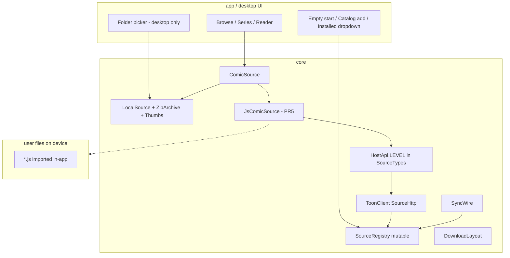
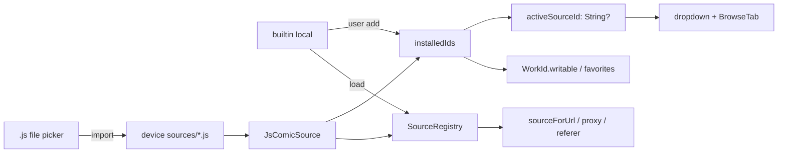
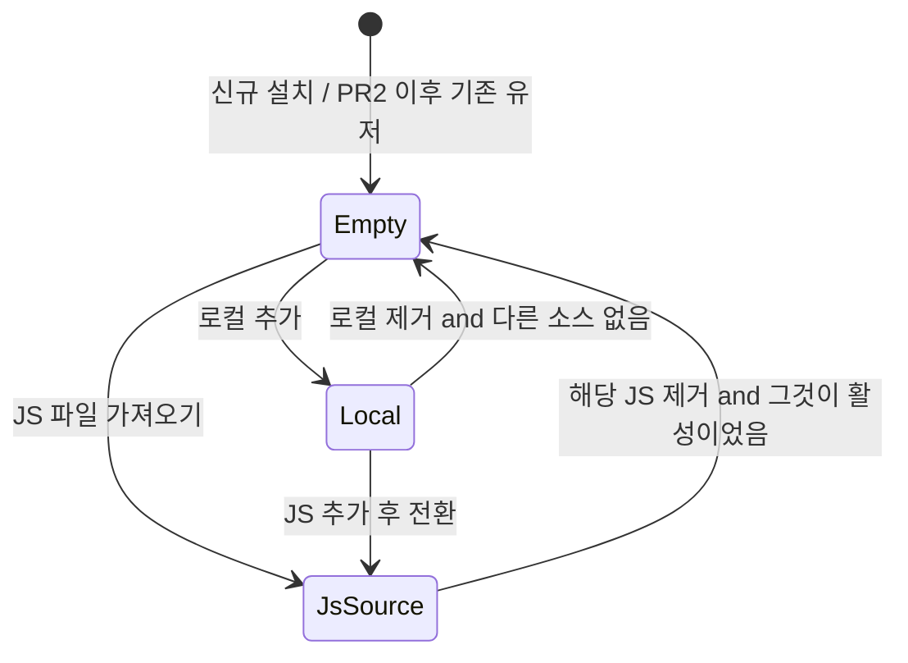
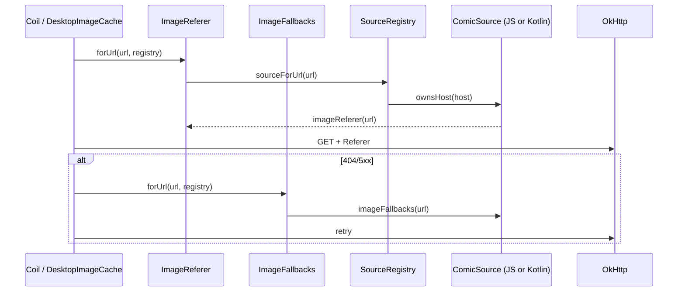
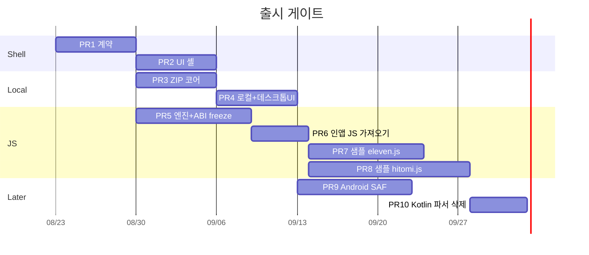

# Comics8 소스 호스트 셸, 로컬 뷰어, JS 어댑터

| 항목 | 값 |
| --- | --- |
| 상태 | Draft |
| 날짜 | 2026-08-22 |
| 저자 | Grok (design) |
| 대상 코드베이스 | `/home/crudust/projects/comics8` (앱 `com.comics8.monitor`, 데스크톱 `com.comics8.desktop`) |
| 관련 모듈 | `:core`, `:app`, `:desktop` |

---

## Overview

Comics8은 현재 `eleven`을 프로세스 수명 기본 소스로 고정한 원격 브라우저다. `SourceRegistry.defaults()`가 `BuiltInSources.all()`(`ElevenToonSource`, `HitomiSource`)을 lazy 싱글톤으로 캐시하고, `WorkId.parse`·`SourceAccess`·`ToonClient.shouldUseProxy`·TopBar 드롭다운·동기화 스키마가 모두 빈 값을 `eleven`으로 채운다. 그 결과 로컬 ZIP/폴더 라이브러리를 넣으려면 원격 사이트 가정(HTTP, downloads/, 폰↔Mac sync, 기본 소스)을 같이 끌고 가게 된다.

이 문서는 **앱을 로컬 뷰어 + 제네릭 JS 호스트**로 재정의한다. 배포되는 APK/`.app`과 `server.py`는 11toon·Hitomi(또는 어떤 특정 사이트)를 **이름으로도 모른다.** 원격 파서는 사용자가 **앱 안에서 `.js` 파일을 올려** 설치한다. 서버는 팩 저장소가 아니다. UI는 `ComicSource`만 본다. 로컬 I/O·ZIP·썸네일·리더·동기화·다운로드·HTTP 엔진은 Kotlin이 소유하고, JS는 사이트별 URL·파싱만 담당한다.

구현 순서: 셸 계약 → 로컬 코어/UI(출시 게이트) → JS 엔진 → **인앱 파일 가져오기** → 레포 `examples/`에 샘플 파서(앱에 넣지 않음) → Kotlin 사이트 패키지 삭제. 서버 `catalog.json` / 팩 GET은 없다.

---

## Background & Motivation

### 현재 상태

소스는 `ComicSource` 한 인터페이스로 이미 잘 잡혀 있다.

```8:61:core/src/main/kotlin/com/comics8/core/source/ComicSource.kt
interface ComicSource {
    val id: String
    val displayName: String
    val origin: String
    val catalogs: List<SourceCatalog>
    val defaultPolicy: RequestPolicy
    val searchPlaceholder: String get() = "제목 검색"
    val enabledByDefault: Boolean get() = id == WorkId.DEFAULT_SOURCE
    val notificationMode: NotificationMode get() = NotificationMode.NONE
    // loadListing / search / suggest / loadEpisodes / resolveImages
    // imageFallbacks / imageReferer / ownsHost / useProxy / resolveParent / applyConfig
}
```

문제는 인터페이스가 아니라 **런타임 기본값**이다.

| 지점 | 현재 동작 | 파일 |
| --- | --- | --- |
| 레지스트리 생성 | `require(sources.isNotEmpty())`, `default = eleven ?: first()` | `SourceRegistry.kt` |
| 프로세스 싱글톤 | `SourceRegistry.defaults()` → `BuiltInSources.all()` lazy 캐시. `chipLabel`/`knownIds`/`isRegistered`/`sourceForUrl`가 여기 묶임 | `SourceRegistry.kt` companion |
| 빈 sourceId | `ifBlank { WorkId.DEFAULT_SOURCE }` (`"eleven"`) | `WorkId`, `SourcePrefs`, `SourceAccess`, `ToonItem`, `SyncWire`, repos |
| 쓰기 권한 | `WorkId.writable`: eleven은 항상 허용, 그 외는 등록+enable | `WorkId.kt:15-26` |
| 활성화 | `resolveActiveId`: 미지/공백이면 eleven | `SourcePrefs.kt:10-13` |
| 활성 소스 제거 | `setSourceEnabled`가 eleven disable을 거부하고, 끄면 `setActiveSource(eleven)` | `DesktopViewModel.kt:323-329`, `ListingViewModel.kt:479-484` |
| UI 드롭다운 | `SourceRegistry.defaults().all()` — 설치 여부와 무관 | `desktop/.../TopBar.kt:454`, `app/.../TopBar.kt:498` |
| HTTP 프록시 | `ToonClient.shouldUseProxy`가 companion 싱글톤 사용 | `ToonClient.kt:182-183` |
| 이미지 | `ImageFallbacks`/`ImageReferer` 기본 인자가 `defaults()` | `ImageFallbacks.kt`, `ImageReferer.kt` |
| 동기화 | schema v1은 eleven만 송신. 무접두 tombstone = eleven | `SyncWire.kt` |
| 다운로드 | 레거시 `{toonId}/` → `eleven/` 마이그레이션 | `DownloadLayout.kt` |
| 로컬 파일 | `file:` URI만. ZIP 랜덤 액세스 없음 | `LocalImageUri.kt` |
| Android 저장소 | INTERNET/알림/설치만. SAF/저장소 권한 없음 | `app/src/main/AndroidManifest.xml` |

`SourcePackageIsolationTest`는 앱/데스크톱/공유 코드가 `eleven`/`hitomi` 패키지를 import하지 못하게 막고, `BuiltInSources.kt`만 구체 사이트를 알게 한다. 이 격리는 유지한다. JS 팩이 그 자리를 대체한다.

### 고통

1. 빈 시작이 불가능하다. 앱을 켜면 11toon 최신 목록 HTTP가 나간다.
2. 로컬 라이브러리를 지금 넣으면 `downloads/`·sync·eleven 기본값과 섞인다.
3. 사이트 파서가 APK에 박혀 있으면 유저가 원하는 사이트를 쓸 수 없고, 깨질 때마다 앱을 다시 배포해야 한다. 서버가 JS를 들고 있으면 배포 주체가 사이트를 고르는 것과 같아서 APK에 넣는 것과 같다.
4. `defaults()` 캐시 때문에 소스를 런타임에 추가/제거할 수 없다.

---

## Goals & Non-Goals

### Goals

- UI·ViewModel·Repository는 `ComicSource`와 설치된 소스 집합만 본다. 활성 소스는 nullable.
- 기본 제품은 **로컬 뷰어**: 사용자 선택 폴더 스캔, 첫 이미지 커버, ZIP/CBZ/이미지 폴더 → 기존 리더(`List<String>` 이미지 URL).
- 원격은 사용자가 앱에서 `.js`를 올려 추가한다. 같은 파일이 Android와 desktop에서 돈다. **앱/서버 코드에 사이트 이름·URL·파서가 없다.**
- 호스트 API는 `apiLevel`로 버전한다. 앱보다 높은 팩은 로드 거부.
- 11toon/Hitomi Kotlin은 이식·테스트용으로 레포에 잠시 남을 수 있으나, PR 2부터 **사용자 카탈로그/드롭다운/서버에 등장하지 않는다.** 샘플 JS는 `examples/sources/`이지 APK 리소스가 아니다.

### Non-Goals

- 현재 eleven-중심 아키텍처 위에 로컬 라이브러리 전체를 구현하지 않는다.
- 로컬을 JS 파서로 만들지 않는다. 파일 I/O, ZIP, SAF, 썸네일은 Kotlin.
- JSON/CSS 사이트 정의, JAR/DEX/Mihon 확장 APK는 채택하지 않는다.
- Android SAF 로컬 라이브러리는 데스크톱 로컬 이후 별도 PR.
- JS Hitomi 이식이 끝나기 전에 로컬 뷰어 출시를 막지 않는다.
- 폰↔Mac 동기화 프로토콜을 schema v3로 올리지 않는다. `local`만 항상 omit.
- 사이트 HTML을 앱 WebView로 렌더하지 않는다.
- 서버가 JS 팩을 보관·배포하지 않는다. `catalog.json` / `GET /sources/*.js` 없음.
- 앱이 특정 사이트(11toon, Hitomi, …)를 기본 offer로 나열하지 않는다.

---

## Key Decisions

1. **베이스 앱 = 로컬 뷰어 + JS 실행 베이스.** 로컬은 in-app `ComicSource`(`id = "local"`)이지 JS가 아니다. 원격은 사용자가 올린 JS뿐이다. **앱과 서버는 11toon/Hitomi를 모른다.** 첫 실행은 local도 자동 설치하지 않는다. 폴더 피커는 로컬을 추가한 뒤(PR 4)만.
2. **`ComicSource`가 UI-facing 유일 API.** 메서드 시그니처는 유지. 사이트 패키지를 UI가 import하지 않는 규칙(`SourcePackageIsolationTest`)은 유지. JS가 노출하는 `id`/`displayName`/`origin`이 곧 그 소스다.
3. **런타임 기본 소스 없음은 PR 2부터.** `WorkId.DEFAULT_SOURCE = "eleven"`은 **옛 DB/싱크 entityId 레거시**로만 남긴다. 제품 카탈로그가 아니다. PR 1은 컴파일·시그니처만 바꾸고 기존 11toon 경로를 유지한다. PR 2부터 내장 사이트 offer 없음, empty CTA.
4. **설치 집합 ≠ 로드된 구현.** 드롭다운/쓰기는 installed. referer/fallback/proxy는 **지금 로드된** `ComicSource`(로컬 + 가져온 JS). PR 1의 `writable`만 `registry.knownIds()` (아직 옛 파서가 로드됨).
5. **`SourceRegistry`는 mutable copy-on-write.** `defaults()` 삭제. 레지스트리 하나, `ToonClient`보다 먼저.
6. **ZIP은 `java.util.zip.ZipFile`.** URI `comics8-zip:`. 데스크톱 File 먼저, Android SAF는 이후 PR.
7. **로컬은 `downloads/`에 쓰지 않고 sync하지 않는다.**
8. **JS 엔진은 Rhino 1.7.x.** host는 `ScriptableObject`. 팩은 사용자가 고른 파일이므로 사이드로드가 **기능**이다. 샌드박스는 파일시스템/Java 반사를 막고, `host.fetch`만 허용.
9. **호스트 API LEVEL = 1**은 D.2 `host.d.ts` 한 장 freeze. `HostApi.LEVEL`은 PR 1 `SourceTypes.kt`. `source/js/`는 PR 5. `apiLevel > HostApi.LEVEL`이면 가져오기 거부.
10. **구현 순서:** 계약(PR 1) → UI 셸(PR 2, 내장 사이트 없음) → 로컬 코어(PR 3) → 로컬 UI(PR 4) → JS 엔진(PR 5) → **인앱 JS 가져오기(PR 6)** → 샘플 `eleven.js`/`hitomi.js`는 레포 `examples/` (PR 7·8, 앱/서버에 넣지 않음) → Android SAF(PR 9) → Kotlin 사이트 패키지 삭제(PR 10).
11. **PR 2 마이그레이션은 eleven을 다시 설치하지 않는다.** `storedActiveRaw()`는 키 없을 때만 null. 기존 유저도 내장 11toon offer를 받지 않는다. 옛 `eleven:` DB 행은 남고, 같은 `id`의 JS를 가져오면 그때 목록이 다시 붙는다.

---

## Proposed Design

### 모듈 경계



**Kotlin이 계속 소유:** OkHttp/`ToonClient`, 서버 프록시(기존 sync/앱 업데이트/이미지 프록시), Coil/Desktop 이미지 로드, 리더, Room/SQLite, 폰↔Mac sync, `downloads/`, 로컬 ZIP/썸네일/스캔, **JS 파일 가져오기·디스크 저장·로드**, WorkManager 알림.

**JS가 소유:** 사이트 URL 구성, HTML/JSON/바이너리 파싱, fallback URL, referer, `ownsHost`/`useProxy`, 검색·회차·이미지 목록.

**서버가 소유하지 않는 것:** 파서 파일, 사이트 카탈로그, 11toon/Hitomi 이름. `server.py`는 기존처럼 version/health/proxy/download만.

**JS가 import하면 안 되는 것:** `com.comics8.core.source.eleven.ComicSite`, `HtmlParsers`, `HitomiUrls`, `GgJsRouter`, `NozomiIndex`, `ToonClient`, Room, Compose, `WorkId` Kotlin 타입(문자열 id만 다룬다).

### 레이어별 런타임 객체



---

## A. Source host contract (Kotlin, in-app, stable ABI)

### A.1 `ComicSource` — 유지 + 보강

파일: `core/src/main/kotlin/com/comics8/core/source/ComicSource.kt`

기존 suspend 메서드와 이미지/알림/부모 해석 API는 **시그니처를 바꾸지 않는다.** UI/Repository가 이미 이 모양에 맞춰져 있다. 추가·변경은 기본값과 메타데이터다.

```kotlin
package com.comics8.core.source

import com.comics8.core.model.ArtistRef
import com.comics8.core.model.EpisodeItem
import com.comics8.core.model.EpisodePage
import com.comics8.core.model.ListingPage
import com.comics8.core.model.ToonItem

interface ComicSource {
    val id: String
    val displayName: String
    val origin: String
    val catalogs: List<SourceCatalog>
    val defaultPolicy: RequestPolicy
    val searchPlaceholder: String get() = "제목 검색"

    /**
     * 카탈로그 설치 시 기본 포함 여부. 인터페이스 기본 false.
     * PR 1: ElevenToonSource는 `override val enabledByDefault = true`로 현재와 동일.
     * PR 2부터 이 플래그는 쓰지 않고 installed 집합이 진실. local은 자동 설치하지 않음.
     */
    val enabledByDefault: Boolean get() = false

    val kind: SourceKind get() = SourceKind.REMOTE
    /** JS 팩이 요구하는 호스트 ABI. Kotlin 구현은 HostApi.LEVEL. */
    val hostApiLevel: Int get() = HostApi.LEVEL
    /** false면 SyncWire outbound/inbound 모두 제외. local = false. */
    val syncParticipates: Boolean get() = kind == SourceKind.REMOTE
    /** false면 downloads/ 큐와 다운로드 UI 숨김. local = false. */
    val writesDownloads: Boolean get() = kind == SourceKind.REMOTE
    /** false면 ToonClient/SourceHttp를 쓰지 않음. 인터페이스 인자는 받되 무시. */
    val requiresHttp: Boolean get() = kind == SourceKind.REMOTE

    val notificationMode: NotificationMode get() = NotificationMode.NONE
    val episodePageSize: Int get() = 100
    val emptyListingOk: Boolean get() = kind == SourceKind.LOCAL
    /**
     * true면 Repository가 빈 EpisodePage를 에러로 올리지 않는다.
     * 기본 false (11toon). local = true. Hitomi = true (anime 갤러리는 빈 회차).
     * `emptyListingOk`와 독립. 현재 `ToonRepository.loadEpisodes`는 빈 목록을 항상 error 한다.
     */
    val emptyEpisodesOk: Boolean get() = false
    val defaultLanguage: String? get() = null
    val favoriteUsesLatestListing: Boolean
        get() = notificationMode == NotificationMode.LATEST_INTERSECTION
    val progressDisplay: ProgressDisplay get() = ProgressDisplay.LAST_READ_ORDER

    fun formatReadProgress(lastReadOrder: Int, totalEpisodes: Int, readCount: Int): String =
        progressDisplay.format(lastReadOrder, totalEpisodes, readCount)

    suspend fun loadListing(catalogId: String, page: Int, http: SourceHttp): ListingPage
    suspend fun search(query: SearchQuery, http: SourceHttp): List<ToonItem>
    suspend fun suggest(query: SearchQuery, http: SourceHttp): List<SearchSuggestion> = emptyList()
    suspend fun loadEpisodes(item: ToonItem, page: Int, http: SourceHttp): EpisodePage
    suspend fun resolveImages(episode: EpisodeItem, item: ToonItem, http: SourceHttp): List<String>

    fun imageFallbacks(url: String): List<String> = emptyList()
    fun imageReferer(url: String): String = defaultPolicy.referer ?: origin
    fun coverUrl(toonId: String): String? = null
    fun supportsChapterNotifications(item: ToonItem): Boolean =
        notificationMode != NotificationMode.NONE

    fun ownsHost(host: String): Boolean = false
    fun useProxy(url: String): Boolean = kind == SourceKind.REMOTE

    fun resolveParent(
        item: ToonItem,
        choice: ArtistRef,
        entryEpisodeId: String? = item.entryEpisodeId,
    ): ToonItem? = null

    fun notificationCandidates(favorites: List<ToonItem>): List<ToonItem> =
        when (notificationMode) {
            NotificationMode.NONE -> emptyList()
            NotificationMode.LATEST_INTERSECTION,
            NotificationMode.PER_FAVORITE,
            -> favorites
        }

    fun applyConfig(config: SourceConfig) {}
    fun searchLanguage(): String? = null
}
```

`SourceKind`와 `HostApi`는 **`SourceTypes.kt`에 둔다** (PR 1). `source/js/` 패키지는 PR 5에서 엔진과 함께 만든다.

```kotlin
// SourceTypes.kt
enum class SourceKind { LOCAL, REMOTE }

object HostApi {
    const val LEVEL: Int = 1
}
```

위 `ComicSource` 스케치 하단의 `enum SourceKind` / `object HostApi` 중복 정의는 넣지 않는다.

**빈 목록:** `emptyListingOk`는 이미 Repository가 사용한다 (`ToonRepository.fetchRemoteListing`, `DesktopToonRepository.fetchRemoteListing`). local/Hitomi = true, 11toon = false 유지.

**검색 제안 / artist parent / 알림 / language / progress:** 이미 `suggest`, `resolveParent`, `notificationMode`, `applyConfig`, `searchLanguage`, `progressDisplay`로 데이터 주도다. UI는 소스 객체의 값을 그대로 쓴다. 셸 PR에서 Hitomi 전용 분기를 새로 만들지 말 것.

**이미지 fallback / referer / proxy:** 메서드는 그대로. 호출부가 `SourceRegistry.defaults()`를 쓰지 않게 바꾸는 것이 계약의 핵심이다.

### A.2 `SourceRegistry` — mutable, 빈 허용, default 삭제

파일: `core/src/main/kotlin/com/comics8/core/source/SourceRegistry.kt`

현재 생성자는 비어 있으면 터지고, `get("")`은 eleven이며, companion이 `BuiltInSources`를 프로세스 수명으로 캐시한다.

교체 계약 (copy-paste):

```kotlin
package com.comics8.core.source

import java.net.URI
import java.util.concurrent.atomic.AtomicReference

class SourceRegistry(initial: List<ComicSource> = emptyList()) {
    private val snapshot = AtomicReference(Snapshot.from(initial))

    fun replaceAll(sources: List<ComicSource>) {
        snapshot.set(Snapshot.from(sources))
    }

    /**
     * UI 스레드에서만 add/remove/replaceAll.
     * Coil interceptor / ToonClient.shouldUseProxy는 [all]/[sourceForUrl]/[getOrNull]만
     * 호출한다 (wait-free read). 인터셉터가 mutate 하면 안 된다.
     */
    fun add(source: ComicSource): Boolean {
        while (true) {
            val prev = snapshot.get()
            if (prev.byId[source.id] != null) return false
            val next = Snapshot.from(prev.sources + source)
            if (snapshot.compareAndSet(prev, next)) return true
        }
    }

    fun remove(id: String): ComicSource? {
        while (true) {
            val prev = snapshot.get()
            val removed = prev.byId[id] ?: return null
            val next = Snapshot.from(prev.sources.filterNot { it.id == id })
            if (snapshot.compareAndSet(prev, next)) return removed
        }
    }

    fun get(id: String): ComicSource =
        getOrNull(id) ?: error("Unknown comic source: $id")

    /** 공백 id는 eleven으로 바꾸지 않는다. */
    fun getOrNull(id: String): ComicSource? {
        if (id.isBlank()) return null
        return snapshot.get().byId[id]
    }

    fun all(): List<ComicSource> = snapshot.get().sources
    fun knownIds(): Set<String> = snapshot.get().byId.keys
    fun contains(id: String): Boolean = getOrNull(id) != null

    fun chipLabel(sourceId: String): String =
        getOrNull(sourceId)?.displayName ?: sourceId.ifBlank { "" }

    fun searchPlaceholder(sourceId: String): String =
        getOrNull(sourceId)?.searchPlaceholder ?: "제목 검색"

    fun progressDisplay(sourceId: String): ProgressDisplay =
        getOrNull(sourceId)?.progressDisplay ?: ProgressDisplay.LAST_READ_ORDER

    fun formatReadProgress(
        sourceId: String,
        lastReadOrder: Int,
        totalEpisodes: Int,
        readCount: Int,
    ): String = progressDisplay(sourceId).format(lastReadOrder, totalEpisodes, readCount)

    /**
     * 저장된 활성 id를 설치 집합 안에서만 살린다. 없으면 null (eleven 아님).
     * [installedIds]가 null이면 loaded ids만 검사 (테스트용).
     */
    fun resolveActive(stored: String?, installedIds: Set<String>? = null): ComicSource? {
        val key = stored?.trim().orEmpty()
        if (key.isEmpty()) return null
        if (installedIds != null && key !in installedIds) return null
        return getOrNull(key)
    }

    /** 매칭 실패 시 eleven으로 떨어지지 않는다. */
    fun sourceForUrl(url: String): ComicSource? {
        val host = hostOf(url) ?: return null
        return all().firstOrNull { it.ownsHost(host) }
    }

    fun applyConfig(config: SourceConfig) {
        all().forEach { it.applyConfig(config) }
    }

    fun applyPreferences(languageFor: (String) -> String?) {
        all().forEach { source ->
            val language = languageFor(source.id) ?: source.defaultLanguage
            if (language != null) source.applyConfig(SourceConfig(language = language))
        }
    }

    fun ownsHost(host: String): Boolean {
        val key = host.lowercase().trim().trim('.')
        if (key.isEmpty()) return false
        return all().any { it.ownsHost(key) }
    }

    fun syncParticipates(sourceId: String): Boolean =
        getOrNull(sourceId)?.syncParticipates == true

    private data class Snapshot(
        val sources: List<ComicSource>,
        val byId: Map<String, ComicSource>,
    ) {
        companion object {
            fun from(sources: List<ComicSource>): Snapshot {
                require(sources.map { it.id }.toSet().size == sources.size) { "duplicate source id" }
                return Snapshot(sources.toList(), sources.associateBy { it.id })
            }
        }
    }

    companion object {
        fun hostOf(url: String): String? =
            try { URI(url).host?.lowercase() } catch (_: Exception) { null }

        /**
         * 테스트 헬퍼. 프로덕션 ToonClient/Image*/UI는 호출 금지.
         * BuiltInSources 브리지가 있는 동안 유닛 테스트가 기존 픽스처를 쓰게 한다.
         */
        fun forTests(sources: List<ComicSource> = BuiltInSources.all()): SourceRegistry =
            SourceRegistry(sources)
    }
}
```

삭제할 것:

- `val default: ComicSource`
- `companion.defaults()` / `cachedDefaults` / `cachedKnownIds` / `chipLabels` / `searchPlaceholders`
- `companion.isRegistered` / `companion.knownIds` / `companion.chipLabel` 등 전부

`BuiltInSources`는 PR 2에서 레지스트리 기본 로드에서 빼고, PR 10에서 사이트 클래스를 삭제한다. 그 전까지는 테스트가 직접 `ElevenToonSource()`를 생성할 수 있다.

**생성 순서 (PR 1, 앱/데스크톱 공통):** 레지스트리 → locator → `ToonClient` → DownloadManager → Repository → Coil/`DesktopImageCache`. `ComicsApp`은 지금 `ToonClient`를 Repository보다 먼저 만든다 (`ComicsApp.kt:35-58`). PR 1에서 순서를 뒤집는다:

```kotlin
val registry = SourceRegistry(BuiltInSources.all())
val locator = SourceLocator { registry }
val toonClient = ToonClient(ToonClient.defaultClient(...), sources = locator)
// Coil interceptor / DesktopImageCache / DownloadManager / Repository 전부 이 registry
```

`ToonClient` 생성자에서 `sources`는 **필수**다. `error("SourceLocator not bound")` 기본값 금지. 테스트는 `SourceLocator { SourceRegistry.forTests() }` 또는 `isProxyEnabled = false`여도 locator를 넘긴다 (`shouldUseProxy`가 인스턴스 메서드가 되면 `isProxyEnabled=false`만으로는 컴파일이 안 끝남 — 생성자 시그니처가 강제).

### A.3 Locator — 이미지 스택이 최신 레지스트리를 보게

Coil interceptor와 `DesktopImageCache`는 앱 수명 동안 살아 있다. 소스를 add/remove하면 같은 인스턴스를 봐야 한다.

```kotlin
fun interface SourceLocator {
    fun registry(): SourceRegistry
}
```

앱/데스크톱은 `ToonRepository`/`DesktopToonRepository`가 가진 `SourceRegistry`를 locator로 넘긴다. `ToonClient`는 locator를 필드로 보관한다.

```kotlin
class ToonClient(
    private val client: OkHttpClient = defaultClient(),
    @Volatile var proxyBaseUrl: String? = SyncConstants.proxyBaseUrl(),
    @Volatile var isProxyEnabled: Boolean = true,
    private val sources: SourceLocator, // 필수. 기본값 없음
) : SourceHttp {
    // fetch() 기존 로직 유지. shouldUseProxy만 인스턴스 메서드로.

    internal fun shouldUseProxy(url: String): Boolean {
        if (!url.startsWith("http://") && !url.startsWith("https://")) return false
        val source = sources.registry().sourceForUrl(url) ?: return false
        return source.useProxy(url)
    }

    /**
     * 이미지 GET. Referer는 locator의 registry에서 온다.
     * 기본 인자 없는 ImageReferer.forUrl(url, registry)를 쓴다.
     */
    fun fetchBytes(url: String): ByteArray {
        val registry = sources.registry()
        val request = Request.Builder()
            .url(url)
            .header("User-Agent", USER_AGENT)
            .header("Accept", "image/avif,image/webp,image/apng,image/*,*/*;q=0.8")
            .header("Referer", ImageReferer.forUrl(url, registry))
            .get()
            .build()
        // ...기존 execute...
    }

    companion object {
        // shouldUseProxy(url) 정적 메서드 삭제. 테스트는 client.shouldUseProxy(url)
    }
}
```

`ImageFallbacks` / `ImageReferer` — 기본 인자 `defaults()` 삭제. locator 또는 registry 필수.

```kotlin
object ImageReferer {
    fun forUrl(url: String, registry: SourceRegistry): String {
        if (url.startsWith("file:", true) ||
            url.startsWith("comics8-zip:", true) ||
            url.startsWith("content:", true)
        ) return ""
        return registry.sourceForUrl(url)?.imageReferer(url).orEmpty()
    }
}

object ImageFallbacks {
    fun forUrl(url: String, registry: SourceRegistry): List<String> =
        registry.sourceForUrl(url)?.imageFallbacks(url).orEmpty()

    fun urlsToTry(url: String, registry: SourceRegistry): List<String> {
        val out = LinkedHashSet<String>()
        out.add(url)
        out.addAll(forUrl(url, registry))
        return out.toList()
    }

    fun fetchBytes(
        url: String,
        registry: SourceRegistry,
        fetch: (String) -> ByteArray,
    ): ByteArray {
        var lastError: Exception? = null
        for (candidate in urlsToTry(url, registry)) {
            try {
                val bytes = fetch(candidate)
                if (bytes.isNotEmpty()) return bytes
            } catch (e: Exception) {
                lastError = e
            }
        }
        throw lastError ?: IllegalStateException("empty image response: $url")
    }
}
```

호출부 (모두 PR 1, 컴파일 센티널 — 기본 인자 없음):

- `ComicsApp.newImageLoader` interceptor: 같은 registry (`ImageReferer.forUrl(url, registry)`, `ImageFallbacks.forUrl(url, registry)`)
- `DesktopImageCache.loadImage`: Main.kt에서 공유한 registry
- `DownloadManager` / `DesktopDownloadManager`: `ImageFallbacks.fetchBytes(url, sources) { client.fetchBytes(it) }`
- `ImageRefererTest` / `ToonClientFetchTest` / `ToonClientProxyTest`: `forTests()` registry 명시
- `ToonClient.fetchBytes`는 위 스케치대로 locator 사용

PR 1 컴파일이 깨지는 곳이 곧 빠진 호출부다. `defaults()` 기본 인자를 남겨 우회하지 말 것.

### A.4 `WorkId` — 저장 레거시 vs 런타임

파일: `core/src/main/kotlin/com/comics8/core/source/WorkId.kt`

```kotlin
data class WorkId(val sourceId: String, val toonId: String) {
    init {
        require(':' !in sourceId) { "sourceId must not contain ':'" }
        require(sourceId.isNotBlank()) { "sourceId must not be blank" }
    }

    fun storageKey(): String = "$sourceId:$toonId"

    companion object {
        /** 저장/동기화 레거시 ID. 런타임 기본 소스가 아니다. */
        const val DEFAULT_SOURCE = "eleven"
        const val LOCAL_SOURCE = "local"

        fun eleven(toonId: String): WorkId = WorkId(DEFAULT_SOURCE, toonId)
        fun local(toonId: String): WorkId = WorkId(LOCAL_SOURCE, toonId)

        /**
         * 레거시 스토리지 전용. 접두 없는 raw / 빈 sourceId → eleven.
         * UI 활성 소스, 새 즐겨찾기, 다운로드 enqueue에는 쓰지 않는다.
         */
        fun parse(raw: String): WorkId {
            val idx = raw.indexOf(':')
            if (idx < 0) return WorkId(DEFAULT_SOURCE, raw)
            val source = raw.substring(0, idx)
            val toonId = raw.substring(idx + 1)
            return WorkId(source.ifBlank { DEFAULT_SOURCE }, toonId)
        }

        /**
         * inbound sync / DB row. 빈 sourceId는 eleven (구서버).
         * local id도 그대로 수용하되 SyncWire가 걸러낸다.
         */
        fun stored(sourceId: String, toonId: String): WorkId? {
            val sid = sourceId.ifBlank { DEFAULT_SOURCE }
            if (toonId.isBlank()) return null
            return try { WorkId(sid, toonId) } catch (_: IllegalArgumentException) { null }
        }

        /**
         * 신규 쓰기. eleven 특권 없음.
         * [installedIds]: 설치된 소스. blank sourceId는 거부.
         */
        fun writable(
            sourceId: String,
            toonId: String,
            sourceEnabled: Boolean,
            installedIds: Set<String>,
        ): WorkId? {
            if (sourceId.isBlank() || toonId.isBlank() || !sourceEnabled) return null
            if (sourceId !in installedIds) return null
            return try { WorkId(sourceId, toonId) } catch (_: IllegalArgumentException) { null }
        }
    }
}
```

**금지:** `WorkId.writable`가 `SourceRegistry.isRegistered` companion을 호출하는 현재 결합. 설치 집합을 인자로 받는다.

테스트 고정값 (`WorkIdTest`):

- `parse("7883")` → 여전히 `eleven:7883` (tombstone/레거시)
- `writable("", "1", true, setOf("eleven"))` → null
- `writable("eleven", "1", false, setOf("eleven"))` → null
- `writable("eleven", "1", true, setOf("eleven"))` → eleven:1
- `writable("local", "/a.zip", true, setOf("local"))` → local:/a.zip

### A.5 `SourceAccess`

```kotlin
object SourceAccess {
    fun isEnabled(sourceId: String, storedEnabled: (String) -> Boolean): Boolean {
        if (sourceId.isBlank()) return false
        return storedEnabled(sourceId)
    }

    fun writable(
        sourceId: String,
        toonId: String,
        storedEnabled: (String) -> Boolean,
        installedIds: Set<String>,
    ): WorkId? = WorkId.writable(sourceId, toonId, isEnabled(sourceId, storedEnabled), installedIds)

    fun writable(
        workId: WorkId,
        storedEnabled: (String) -> Boolean,
        installedIds: Set<String>,
    ): WorkId? = writable(workId.sourceId, workId.toonId, storedEnabled, installedIds)
}
```

**PR 1 vs PR 2 (writable / enabled):**

- PR 1: `WorkId.writable`에서 eleven 특권과 `SourceRegistry.isRegistered` companion 호출을 제거한다. 시그니처는 `installedIds: Set<String>` 필수. **호출부는 전부 `installedIds = registry.knownIds()`**. `SourceAccess.isEnabled`의 eleven early-return (`sid == DEFAULT_SOURCE || storedEnabled`)은 **PR 1에서 유지**해서 `DesktopSourcePrefs.isEnabled` / `ComicsApp` 람다가 아직 eleven을 끄지 못해도 즐겨찾기·다운로드가 죽지 않는다. 제품 uninstall은 PR 2.
- PR 2: `isEnabled` early-return 삭제. `storedEnabled(id) == (id in installedIds)`. `ComicsApp` 람다와 `DesktopSourcePrefs.isEnabled` / `setEnabled` eleven no-op를 **같은 PR에서** 갈아 끼운다. writable 호출부는 `installedIds = settings.installedIds()`.

### A.6 `SourceHttp` — 로컬은 인자를 무시

파일: `core/src/main/kotlin/com/comics8/core/source/SourceHttp.kt` 시그니처 유지.

`LocalSource`는 `http`를 호출하지 않는다. Repository는 PR 4에서도 기존처럼 `client`를 넘겨도 된다 (dead letter 방지: 분기를 강제하지 않음). `NoopSourceHttp`는 테스트 픽스처용으로만 두며 프로덕션 배선 필수가 아니다.

### A.7 Repository 계약 변경

PR 1은 `sources.default` 프로퍼티를 지우되 **`sourceOrDefault` 헬퍼는 남긴다.** ViewModel `tabs.first()` / `loadPage(1)` 경로가 죽지 않게.

```kotlin
fun source(id: String): ComicSource = sources.get(id)
fun sourceOrNull(id: String): ComicSource? = sources.getOrNull(id)
/** PR 1 유지. PR 2에서 삭제. */
fun sourceOrDefault(id: String): ComicSource =
    sources.getOrNull(id)
        ?: sources.getOrNull(WorkId.DEFAULT_SOURCE)
        ?: error("no comic source loaded")
fun allSources(): List<ComicSource> = sources.all()

suspend fun loadListing(tab: BrowseTab, page: Int): ListingPage
suspend fun loadImages(episode: EpisodeItem, workId: WorkId? = null): List<String>
```

writable 헬퍼 (PR 1):

```kotlin
private fun writableId(sourceId: String, toonId: String): WorkId? =
    SourceAccess.writable(sourceId, toonId, isSourceEnabled, sources.knownIds())
```

PR 2에서 추가/변경:

```kotlin
fun installedSources(): List<ComicSource>
fun activeSource(): ComicSource?   // null 가능
// sourceOrDefault 삭제. ViewModel은 activeSource() ?: return
// search/suggest 기본 인자 `= WorkId.DEFAULT_SOURCE` 삭제
// loadImages: workId?.sourceId ?: eleven 폴백 삭제. 호출자가 sourceId를 넘김
// loadEpisodes: source.emptyEpisodesOk 이면 빈 페이지 허용 (구현은 PR 4에서 로컬과 함께)
```

`sourceFor(item) = sources.get(item.sourceId)` — PR 1에서 빈 `sourceId`는 더 이상 eleven이 아니므로 throw. 기존 DB 행은 이미 `'eleven'`으로 채워져 있다 (`AppDatabase`/`DesktopDatabase` 마이그레이션). PR 1 테스트: `sourceFor(ToonItem(..., sourceId=""))`가 throw. 신규 파서는 stamp 필수.

### A.8 `BrowseTab` 빈 소스

`BrowseTab.forSource(source)`는 유지.

**PR 1:** `resolveLaunchTarget` / `afterSourceChange`의 `Favorite(WorkId.DEFAULT_SOURCE)` 폴백 **유지**. `BrowseTabTest`가 `SourceRegistry.defaults().default`를 쓰면 `forTests().get("eleven")`으로만 고친다. empty-state 동작 변경 없음.

**PR 2:** 활성이 null이면 ViewModel이 `browseTabs = emptyList()` + listing fetch 안 함. `Favorite(eleven)` 폴백 삭제. `ListingUiState.activeSourceId: String?`, `DesktopUiState.activeSourceId: String?`. 기본 탭은 더 이상 `BrowseTab.Remote(eleven, LATEST)`가 아니다 (empty list / placeholder).

---

## B. Installed-source vs catalog contract

### B.1 세 집합

| 이름 | 의미 | 저장 | UI |
| --- | --- | --- | --- |
| **Offer** | 앱이 아는 추가 방법 | 내장 `local` + “JS 파일 가져오기” | “소스 추가” 시트. 사이트 이름 목록 없음 |
| **Installed** | 로컬을 켰거나 JS를 가져온 소스 | prefs `sources.installed` + 디스크의 `.js` | TopBar 드롭다운 **이것만** |
| **Loaded** | 프로세스 안 `ComicSource` | `LocalSource` + 가져온 `JsComicSource` | 비표시. referer/proxy |

`SourceOffer`는 **내장 local 하나**다. 11toon/Hitomi용 `BuiltinOffers.ELEVEN` 같은 상수는 만들지 않는다. JS 소스의 `id`/`displayName`은 파일 안의 `source` 객체가 정한다.

**로컬 offer 등장 시점:** PR 2는 사이트 offer가 없다 (empty CTA + 나중에 PR 6이 붙일 “JS 가져오기” 자리만). `local`과 `LocalSource.kt`는 PR 4. Android local은 PR 9. PR 2가 LocalSource stub을 만들지 않는다.

```kotlin
data class SourceOffer(
    val id: String,
    val displayName: String,
    val implementation: SourceImplementation,
)

enum class SourceImplementation { BUILTIN_LOCAL, JS_PACK }

object BuiltinOffers {
    val LOCAL = SourceOffer("local", "로컬", SourceImplementation.BUILTIN_LOCAL)
    fun bundled(): List<SourceOffer> = listOf(LOCAL)
}
```

가져온 JS는 offer 테이블이 아니라 `ImportedSource` 행이다 (`id`, `displayName`, `fileName`, `apiLevel`, `importedAt`).

### B.2 Persistence

키는 `SourcePrefs`에 모은다. 파일: `core/src/main/kotlin/com/comics8/core/source/SourcePrefs.kt`

```kotlin
object SourcePrefs {
    const val ACTIVE_SOURCE_KEY = "pref_active_source_id"
    const val INSTALLED_KEY = "sources.installed"          // JSON array of ids
    const val INSTALL_MIGRATED_KEY = "sources.install_migrated" // "1"
    const val LIBRARY_ROOTS_KEY = "local.library_roots"    // JSON array of absolute paths (desktop)
    fun enabledKey(sourceId: String): String = "sources.$sourceId.enabled" // 마이그레이션만
    fun languageKey(sourceId: String): String = "$sourceId.language"

    fun parseIdList(raw: String?): List<String> { /* JSON array; 실패 시 empty */ }
    fun formatIdList(ids: Collection<String>): String { /* JSON array */ }

    /**
     * 활성 소스. 공백/미설치 → null. eleven 폴백 없음.
     */
    fun resolveActiveId(stored: String?, installed: Set<String>): String? {
        val key = stored?.trim().orEmpty()
        if (key.isEmpty() || key !in installed) return null
        return key
    }

    /**
     * 기존 설치 마이그레이션.
     * - 이미 INSTALLED_KEY가 있으면 그대로.
     * - 없으면: hitomi enabled prefs, ACTIVE_SOURCE_KEY 명시 값, hasLegacyUserData.
     * hasLegacyUserData = favorites/history/read/downloads 중 하나라도 있음.
     * 신규 유저(데이터 없음, 키 없음) → installed empty, active null.
     */
    data class Migration(
        val installed: Set<String>,
        val activeId: String?,
        val wrote: Boolean,
    )

    fun migrateInstalled(
        storedInstalled: String?,
        storedActive: String?,
        hitomiEnabledPref: Boolean?,
        hasLegacyUserData: Boolean,
    ): Migration {
        if (storedInstalled != null) {
            val installed = parseIdList(storedInstalled).toSet()
            return Migration(installed, resolveActiveId(storedActive, installed), wrote = false)
        }
        val installed = linkedSetOf<String>()
        val explicitActive = storedActive?.trim()?.takeIf { it.isNotEmpty() }
        if (hasLegacyUserData || explicitActive != null) {
            installed += WorkId.DEFAULT_SOURCE
        }
        if (hitomiEnabledPref == true) installed += "hitomi"
        if (explicitActive != null) installed += explicitActive
        return Migration(installed, resolveActiveId(explicitActive, installed)
            ?: installed.firstOrNull { it == WorkId.DEFAULT_SOURCE },
            wrote = true)
    }
}
```

플랫폼 저장:

- Android: `SharedPreferences("comics_reader_prefs")` — 이미 `ListingViewModel`/`ComicsApp`이 사용.
- Desktop: `Preferences.userRoot().node("com.comics8.desktop")` — `DesktopSourcePrefs`.

`DesktopSourcePrefs` / Android prefs 래퍼 계약:

```kotlin
interface SourceSettings {
    fun installedIds(): Set<String>
    fun setInstalledIds(ids: Set<String>)
    /**
     * 키가 디스크에 있을 때만 값. 없으면 null.
     * Android: prefs.contains(ACTIVE_SOURCE_KEY) 가 false → null.
     * Desktop: prefs.keys().contains(ACTIVE_SOURCE_KEY) 가 false → null.
     *   Java Preferences.get(key, "eleven") 을 쓰지 않는다.
     */
    fun storedActiveRaw(): String?
    fun activeSourceId(): String?               // resolveActiveId(storedActiveRaw(), installed)
    fun setActiveSourceId(id: String?)          // null → 키 remove. 빈 문자열로 쓰지 말 것
    fun language(sourceId: String): String?
    fun setLanguage(sourceId: String, value: String)
    fun libraryRoots(): List<String>
    fun setLibraryRoots(paths: List<String>)
    fun implementationOverride(sourceId: String): String? // null | "kotlin" | "js"
}
```

`migrateInstalled`는 **PR 2**에서만 호출한다. 인자 `storedActive`는 반드시 `storedActiveRaw()`다. `ListingViewModel`의 `getString(ACTIVE, eleven)`이나 `DesktopSourcePrefs.activeSourceId` 현재 getter를 넣으면 신규 유저에게 eleven이 재설치된다.

PR 2 테스트 (core 또는 prefs 단위):

1. 키 없음, DB 빈 → installed empty, active null
2. `sources.installed` 없음, `pref_active_source_id` 없음, favorite 1행 → `{eleven}`
3. `sources.hitomi.enabled=true`만 → `{hitomi}`
4. getter-style 기본값 `"eleven"`을 `storedActive`로 넘기는 테스트는 **실패해야 할 계약**으로 적지 말고, raw API 테스트가 키 없음을 null로 단언

`isEnabled(id)` = `id in installedIds()` 는 PR 2. eleven uninstall 허용. `setEnabled(eleven, false)` 조기 return 삭제도 PR 2.

### B.3 빈 시작 / 활성 소스 제거



규칙:

- 드롭다운 = installed만. 비어 있으면 “소스 추가”.
- 소스 추가 시트: **로컬**(PR 4/9) + **JS 파일 가져오기**(PR 6). 11toon/Hitomi 행 없음.
- `setActiveSource(id)`는 `id in installed`일 때만. 방금 추가/가져온 소스를 연다 (빈 화면에서 나가는 유일한 자동 활성).
- 활성 소스를 빼면 **항상 null empty state**.
- **첫 실행은 아무것도 자동 설치하지 않는다.** 기존 유저에게 eleven을 installed로 넣지 않는다.

### B.4 레거시 DB / tombstone

| 데이터 | 마이그레이션 | 런타임 |
| --- | --- | --- |
| Room/SQLite `sourceId` 빈 값 | 이미 MIGRATION이 `'eleven'`을 넣음 (`AppDatabase`, `DesktopDatabase.rebuildIfLegacy`) | 빈 값은 `WorkId.stored`만 eleven으로 |
| tombstone `entityId` 무접두 `"12345"` | `WorkId.parse` → `eleven:12345` **유지** | UI 활성 소스와 무관 |
| `ToonItem.sourceId` 기본값 `"eleven"` | 필드 기본값은 호환을 위해 유지 | 새 소스는 반드시 stamp (`LocalSource`/`JsComicSource`) |
| `sources.hitomi.enabled=true` | installed에 `hitomi` | enabled 키는 더 이상 읽지 않음 (마이그레이션 한 번) |

**런타임이 하면 안 되는 것:** 사용자에게 활성 소스가 없을 때 listing/search/HTTP를 eleven으로 보내는 것. `WorkId.parse`의 eleven 폴백을 UI `setActiveSource` 경로에 재사용하지 말 것.

### B.5 설치·활성·로드 상태 기계 (PR 1–8)

Coil `add`/`remove` 금지. JS reload는 `remove(id)` 후 `add(js)` — 같은 id로 `add` 하면 false.

| 이벤트 | loaded (`SourceRegistry`) | installed (prefs) | active |
| --- | --- | --- | --- |
| PR 1 콜드스타트 | `BuiltInSources.all()` (아직 옛 파서, 컴파일 유지) | 없음. writable은 `knownIds()` | prefs 기본 eleven. ViewModel `sourceOrDefault` |
| PR 2 신규·기존 | 사이트 파서 **레지스트리에서 제거** (UI에 안 보임) | `{}` — eleven 재설치 없음 | null, “소스 추가” CTA |
| 로컬 추가 (PR 4 desktop / PR 9 Android) | `LocalSource` add | ∪ `{local}` | `local` |
| JS 가져오기 (PR 6) | `add(JsComicSource)` — `source.id`가 이미 있으면 교체(`remove`+`add`) | ∪ `{id}` | 방금 가져온 id |
| JS/로컬 제거 | 해당 impl unload. JS 파일은 디스크에서 삭제 가능 | `{id}` 삭제 | 그것이 활성이면 null |

PR 1에서 `migrateInstalled`를 호출하지 않는다. 앱은 “전부 loaded = 사실상 설치”처럼 동작한다.

---


## C. Local library contract (in-app, not JS)

패키지: `core/src/main/kotlin/com/comics8/core/source/local/`  
JS 엔진과 사이트 패키지와 분리. `BuiltInSources`가 아니라 `LocalSource`를 앱이 명시적으로 registry에 넣는다 (설치 시에만).

### C.1 ZIP

```kotlin
class ZipArchive(file: File) : Closeable {
    fun imageEntries(): List<String>     // natural sort, skip junk
    /** zip-slip: normalize `\` → `/`, reject leading `/`, reject `..` 세그먼트. 아니면 IllegalArgumentException. */
    fun open(entryName: String): InputStream
    fun firstImageEntry(): String?
}

private fun normalizeZipEntry(name: String): String {
    val n = name.replace('\\', '/').trimStart('/')
    require(n.isNotEmpty() && n.split('/').none { it == ".." }) { "illegal zip entry: $name" }
    return n
}
```

엔트리 크기 상한: 단일 엔트리 75MB를 넘으면 `open`이 거부 (OOM). 테스트에 `../evil.jpg` entry fixture.

object ZipImageNames {
    val IMAGE_EXTS: Set<String> = setOf("jpg", "jpeg", "png", "webp", "avif", "gif")

    fun isJunkEntry(name: String): Boolean {
        val n = name.replace('\\', '/')
        if (n.startsWith("__MACOSX") || "/__MACOSX/" in "/$n") return true
        val base = n.substringAfterLast('/')
        if (base == ".DS_Store" || base.startsWith(".")) return true
        return false
    }

    fun isImageEntry(name: String): Boolean {
        if (isJunkEntry(name) || name.endsWith("/")) return false
        val ext = name.substringAfterLast('.', "").lowercase()
        return ext in IMAGE_EXTS
    }
}

object NaturalSort : Comparator<String> {
    /**
     * 토큰: 비숫자 런 + 숫자 런.
     * 숫자 런은 BigInteger로 비교 → `1` == `01` == `001` (값).
     * 값이 같으면 숫자 문자열 길이 짧은 쪽이 앞 (`1` < `01` < `001`).
     * 비숫자는 UTF-16 case-insensitive (`String.CASE_INSENSITIVE_ORDER`).
     * 최종 타이브레이커: 원본 문자열.
     */
}
```

구현 제약: **`ZipFile(file)`만.** `ZipInputStream`으로 엔트리를 순회하며 디코딩하지 않는다. 리더가 페이지 점프할 때 해당 엔트리만 연다.

### C.2 URI

기존 `LocalImageUri` (`file:` ↔ `File`)는 그대로 둔다. ZIP용 스키마를 추가한다.

```kotlin
object ZipImageUri {
    const val SCHEME = "comics8-zip"

    data class Ref(val zip: File, val entry: String)

    /**
     * comics8-zip:///absolute/path/to.cbz!/nested/001.jpg
     * zip 경로와 entry는 UTF-8 percent-encode. 구분자 `!/` 는 Java jar: URL과 동일.
     */
    fun encode(zip: File, entry: String): String
    fun parse(url: String): Ref?
}

object LocalImageUri {
    fun fromFile(file: File): String = file.toURI().toString()
    fun toFile(url: String): File?
}
```

Android Coil: `comics8-zip` Fetcher가 `ZipArchive.open` → `source`. 데스크톱 `DesktopImageCache.loadImage`가 `file:` 다음에 `ZipImageUri.parse`를 본다. HTTP/fallback 경로로 넣지 않는다.

### C.3 스캔 규칙

라이브러리 루트 `R`에 대해 **한 단계만** 본다 (재귀 무한 스캔 금지).

| `R`의 자식 | 작품 | 회차 |
| --- | --- | --- |
| `foo.cbz` / `foo.zip` | 작품 1, 제목 = stem | 에피소드 1 = 그 ZIP의 이미지 엔트리 |
| 이미지 파일만 있는 폴더 `bar/` | 작품 1, 제목 = `bar` | 에피소드 1 = 폴더 이미지 natural sort |
| 폴더 `series/` 안에 zip/cbz 및/또는 이미지 폴더 | 작품 1, 제목 = `series` | 자식 각각이 에피소드, natural sort |
| 빈 폴더, 숨김, `__MACOSX` | 무시 | |
| 루트의 느슨한 이미지 파일 (폴더 아님) | 같은 루트를 가상 이미지 폴더로 묶지 않음. 무시 (실수 스캔 방지). 이미지는 폴더로 넣으라고 UI에 안내 | |
| `series/` 안에 zip/cbz/이미지**폴더**와 **느슨한 이미지 파일**이 섞임 | 작품 1 | zip과 이미지 폴더만 회차. **시리즈 레벨의 느슨한 이미지는 무시** (루트와 동일) |

`LocalWorkId` 안정성: `toonId`는 종류 접두 + canonical path.

- zip 작품: `zip:<canonical>`
- 이미지 폴더 작품: `dir:<canonical>`
- 시리즈 폴더: `series:<canonical>`

`WorkId("local", toonId)`. path에 `:`가 있어도 `parse`는 첫 콜론만 소스 구분에 쓴다.

에피소드 `wrId`:

- 단일 zip 작품: zip canonical path
- 시리즈의 zip: 그 zip canonical
- 이미지 폴더: 폴더 canonical

### C.4 썸네일

`:core`는 이미지 코덱이 없다 (`core/build.gradle.kts`: OkHttp/Jsoup/coroutines/JSON). `ImageIO`는 Android에 없다. 디코드/리사이즈는 플랫폼이 주입한다.

```kotlin
fun interface ThumbEncoder {
    fun jpeg(bytes: ByteArray, longEdgePx: Int, quality: Int): ByteArray
}

data class ThumbKey(val path: String, val mtimeEpochMs: Long, val sizeBytes: Long)

class CoverThumbCache(
    private val dir: File,
    private val encoder: ThumbEncoder,
    private val longEdgePx: Int = 320,
    private val quality: Int = 80,
) {
    fun fileFor(key: ThumbKey): File  // dir / sha256(path|mtime|size).jpg
    fun getOrCreate(key: ThumbKey, decodeFull: () -> ByteArray): File {
        val dest = fileFor(key)
        if (dest.isFile && dest.length() > 0L) return dest
        dest.writeBytes(encoder.jpeg(decodeFull(), longEdgePx, quality))
        return dest
    }
}
```

- 코어는 키 해시와 바이트 기록만. JPEG 리사이즈는 `ThumbEncoder`.
- Desktop PR 4: AWT `BufferedImage` / `ImageIO`.
- Android PR 9: `Bitmap`.
- PR 3 단위 테스트: fake encoder가 받은 바이트·longEdge를 단언 (실제 디코드 불필요).
- 키 miss 또는 원본 mtime/size 변경 시 재생성.
- 위치: desktop `~/.comics8/thumbs/`, Android `context.cacheDir/thumbs/`.
- `ToonItem.thumbUrl` = `LocalImageUri.fromFile(thumbFile)`.

### C.5 `LocalSource`

```kotlin
class LocalSource(
    private val roots: () -> List<File>,
    private val thumbs: CoverThumbCache,
    private val scan: LibraryScanner = LibraryScanner(),
) : ComicSource {
    override val id = WorkId.LOCAL_SOURCE
    override val displayName = "로컬"
    override val origin = "local://"
    override val kind = SourceKind.LOCAL
    override val catalogs = listOf(SourceCatalog("LIBRARY", "보관함", paginated = false))
    override val defaultPolicy = RequestPolicy(userAgent = "Comics8/Local")
    override val searchPlaceholder = "파일명 검색"
    override val emptyListingOk = true
    override val notificationMode = NotificationMode.NONE
    override val syncParticipates = false
    override val writesDownloads = false
    override val requiresHttp = false
    override val emptyEpisodesOk = true
    override fun useProxy(url: String): Boolean = false

    override suspend fun loadListing(catalogId: String, page: Int, http: SourceHttp): ListingPage
    override suspend fun search(query: SearchQuery, http: SourceHttp): List<ToonItem>
    override suspend fun loadEpisodes(item: ToonItem, page: Int, http: SourceHttp): EpisodePage
    override suspend fun resolveImages(episode: EpisodeItem, item: ToonItem, http: SourceHttp): List<String>
    // suggest empty, ownsHost false, imageFallbacks empty, resolveParent null
}
```

`resolveImages` 반환:

- ZIP 회차: `ZipImageUri.encode(zip, entry)` 리스트 (junk 제외, natural sort)
- 폴더 회차: `LocalImageUri.fromFile(image)` 리스트

검색: 작품 제목(폴더/파일 stem) contains, 대소문자 무시. 네트워크 없음.

**PR 4 Repository:** `loadEpisodes`의 `if (parsed.items.isEmpty()) error("회차 목록을 읽지 못했습니다.")`를 `if (parsed.items.isEmpty() && !source.emptyEpisodesOk) error(...)`로 바꾼다 (`ToonRepository.kt:115-118`, `DesktopToonRepository` 동일). 빈 zip/junk-only/빈 시리즈 폴더는 빈 그리드. 빈 zip/junk-only/빈 시리즈 폴더는 빈 그리드. 샘플 Hitomi JS의 anime 빈 회차도 `emptyEpisodesOk`에 의존한다.

### C.6 로컬과 downloads / sync

- `writesDownloads = false` → Series 화면 다운로드 버튼 숨김. `DownloadManager.enqueue`는 `SourceAccess.writable` + `source.writesDownloads` 가드.
- 파일을 `~/.comics8/downloads` 또는 `context.filesDir/downloads`에 복사하지 않는다. 원본 경로를 직접 읽는다.
- `SyncWire.allowOutbound`: `sourceId == "local"` 또는 `!syncParticipates` → 항상 false. schema v2여도 local을 올리지 않는다.
- inbound row에 `sourceId=local`이 오면 버린다 (다른 기기의 경로는 무의미).
- 즐겨찾기/히스토리/읽음은 **기기 로컬 DB에만** 남긴다. 같은 경로가 Mac에 있어도 id가 절대 경로라 키가 다르다 — 의도적.

### C.7 데스크톱 우선, Android SAF는 후속

ZIP 코어는 `java.io.File`만 받는다. `ParcelFileDescriptor`/`DocumentFile`을 `ZipArchive`에 넣지 않는다.

데스크톱 UI (PR4): AWT/`java.awt.FileDialog` 또는 Compose file kit으로 폴더 선택 → `SourceSettings.setLibraryRoots`. 루트 목록 편집(추가/제거)은 로컬이 활성일 때만 Browse 빈 상태 또는 보관함 탭 상단.

Android (PR9): `ACTION_OPEN_DOCUMENT_TREE`, persistable URI permission. `ZipArchive` 옆에 `SafZipArchive(fd)`를 두거나, 읽기 전용 캐시 복사. 매니페스트에 광역 `READ_EXTERNAL_STORAGE`를 새로 넣지 않고 SAF만.

---

## D. JS host API contract (commonization boundary)

패키지: `core/src/main/kotlin/com/comics8/core/source/js/`  
의존성: `org.mozilla:rhino:1.7.15`를 `:core`에 추가 (PR5). Jsoup/OkHttp는 이미 `:core` API.

### D.0 ABI freeze 위치

LEVEL 1은 **이 절 D.2의 `host.d.ts` + Kotlin `HostApiV1` 한 쌍**이다. D.3 스크립트 JSON 맵도 freeze. PR 5가 구현하고 테스트를 넣는다. PR 7/8은 `HostApiV1`을 수정하지 않는다.

### D.1 엔진 선택

| 엔진 | Android minSdk 26 | Desktop JVM 17 | 샌드박스 | 비고 |
| --- | --- | --- | --- | --- |
| **Rhino 1.7.15** | 순수 JVM, 가능 | 가능 | `ClassShutter` + LiveConnect off | **채택** |
| GraalJS | Android에서 비현실 | 우수 | 우수 | 기각 |
| QuickJS / Duktape JNI | NDK | Mac `.app` JNI 이중 유지 | 별도 | 기각 (Hitomi 성능 문제 시에만 재검토) |
| J2V8 | 사실상 폐기 | — | — | 기각 |

권장: Rhino. Hitomi 목록의 병목은 HTTP(nozomi + gallery.js × 25)이지 JS CPU가 아니다. `gg.js`는 `host.evalSiteJs("gg", text)`로만 평가한다.

격리 (구현 가능해야 함 — `{ false }` ClassShutter는 host 호출을 죽인다):

- `host`는 **`ScriptableObject` 서브클래스** (`com.comics8.core.source.js.HostObject`). Java 인터페이스를 `javaToJS`/`LiveConnect`로 넘기지 않는다.
- `body`/Bytes도 Scriptable 래퍼. JS에 `byte[]` / `java.io.File` / `OkHttp`를 노출하지 않는다.
- `ClassShutter.visibleToScripts(fqn)` allowlist: `com.comics8.core.source.js.` 로 시작하는 클래스만 `true`. 그 외 `false`.
- LiveConnect off: `ContextFactory`에서 `Packages`, `JavaImporter`, `JavaAdapter`, `org.mozilla.javascript.NativeJavaObject` 경로를 막는다.
- 워커 스레드. 기본 wall-clock **30s per source call** (`loadListing` 등). `fetchAll`의 HTTP는 그 안에 포함. 코루틴 cancel → thread interrupt.
- Android R8: 기존 `proguard-rules.pro`는 `-keep class com.comics8.**`만 있다. **반드시** `-keep class org.mozilla.javascript.** { *; }` 추가.

QuickJS 재평가 트리거: 데스크톱 픽스처 HTTP에서 Hitomi 검색 25 ids+cards **p95 > 3초** (PR 8 수락 기준 미달).

### D.2 Host object (freeze, API LEVEL 1)

스크립트가 호출할 수 있는 **유일한** 전역은 `host`다. 아래 TS와 Kotlin은 같은 ABI다. 필드를 추가하면 LEVEL을 올린다.

```ts
// host.d.ts — LEVEL 1 FREEZE. PR 5 구현. PR 7/8은 이 파일을 수정하지 않음.

/** Opaque byte buffer. Methods live on host, not on the buffer. */
interface Bytes {}

interface HostFetchSpec {
  url: string;
  method?: "GET" | "HEAD"; // default GET
  /**
   * Copied onto FetchSpec.headers (ToonClient.buildRequest extra loop).
   * NEVER merged into RequestPolicy.extraHeaders — that path SKIPS Range
   * (ToonClient.kt:135-140). Range MUST be headers["Range"] = "bytes=start-end".
   */
  headers?: { [name: string]: string };
}

interface HostFetchResult {
  code: number;
  /** Case-insensitive; same as HttpResult.header */
  header(name: string): string | null;
  /**
   * HttpResult.totalLength(): Content-Range ".../N" else Content-Length.
   * Needed for NozomiIndex.lastPage (HitomiSourceTest / NozomiIndexTest).
   */
  totalLength(): number | null;
  body: Bytes;
}

interface HostHtmlEl {
  text(): string;
  html(): string;
  attr(name: string): string;
  absUrl(attr: string): string;
  select(css: string): HostHtmlEl[];
}

interface HostHtmlDoc {
  select(css: string): HostHtmlEl[];
}

interface HostApiV1 {
  readonly apiLevel: 1;
  readonly language: string | null;

  fetch(spec: HostFetchSpec): HostFetchResult;
  fetchText(spec: HostFetchSpec): string;
  /**
   * Parallel GET/HEAD. Default concurrency 6 (HitomiSource.GALLERY_CONCURRENCY).
   * Each spec is FetchSpec.headers as above; 200+Range is sliced like
   * ToonClient.applyRangeSlice. Backoff (403/429/5xx) is Kotlin-owned:
   * same delays as HitomiSource.BACKOFF_MS [250, 1000, 4000] inside fetch/fetchAll.
   */
  fetchAll(specs: HostFetchSpec[], concurrency?: number): HostFetchResult[];
  isAccessible(url: string): boolean;

  parseHtml(text: string, baseUrl?: string): HostHtmlDoc;
  json(text: string): any;
  jsonFromBody(body: Bytes): any;
  utf8(body: Bytes): string;

  /**
   * Hitomi site JS only. Eval scope is empty: no `host`, no Java, no source.
   * kind "galleryinfo": `var galleryinfo = {...};` → object
   *   (strip like GalleryInfoParser.extractJson, then json(); eval if not JSON).
   * kind "gg": evaluate gg.js, return `{ b: string, m: (g:number)=>number, s: (h:string)=>string }`.
   * Anything else throws.
   */
  evalSiteJs(kind: "galleryinfo" | "gg", text: string): any;

  u32be(body: Bytes, offset: number): number;
  byteLength(body: Bytes): number;
  slice(body: Bytes, start: number, endExclusive: number): Bytes;

  log(level: "debug" | "info" | "warn" | "error", message: string): void;
}
```

Kotlin (`core/.../source/js/HostApiV1.kt`, PR 5). JS 바인딩은 `HostObject : ScriptableObject`가 이 인터페이스를 위임:

```kotlin
interface HostApiV1 {
    val apiLevel: Int get() = HostApi.LEVEL
    val language: String?
    fun fetch(spec: HostFetchSpec): HostFetchResult
    fun fetchText(spec: HostFetchSpec): String
    fun fetchAll(specs: List<HostFetchSpec>, concurrency: Int = 6): List<HostFetchResult>
    fun isAccessible(url: String): Boolean
    fun parseHtml(text: String, baseUrl: String?): HostHtmlDoc
    fun json(text: String): Any?
    fun jsonFromBody(body: ByteArray): Any?
    fun utf8(body: ByteArray): String
    fun evalSiteJs(kind: String, text: String): Any?
    fun u32be(body: ByteArray, offset: Int): Long
    fun byteLength(body: ByteArray): Int
    fun slice(body: ByteArray, start: Int, endExclusive: Int): ByteArray
    fun log(level: String, message: String)
}

data class HostFetchSpec(
    val url: String,
    val method: String = "GET",
    val headers: Map<String, String> = emptyMap(),
)

class HostFetchResult(
    val code: Int,
    private val headers: Map<String, String>,
    val body: ByteArray,
) {
    fun header(name: String): String? =
        headers.entries.firstOrNull { it.key.equals(name, ignoreCase = true) }?.value
    fun totalLength(): Long? = HttpResult(code, headers, body).totalLength()
}
```

어댑터 매핑 (필수):

```kotlin
fun toFetchSpec(src: ComicSource, spec: HostFetchSpec): FetchSpec =
    FetchSpec(
        url = spec.url,
        policy = src.defaultPolicy,                 // UA, referer, extraHeaders — no Range here
        headers = spec.headers,                     // Range lives here
    )
```

프록시: 스크립트 `useProxy(url)` → `JsComicSource.useProxy` → 레지스트리 → `ToonClient.shouldUseProxy`. HEAD/`isAccessible`는 11toon 다중 이미지 후보에 필요. HTML은 Jsoup 래핑, JS에 Jsoup 클래스 없음.

### D.3 Script export (freeze)

각 파일은 전역 `source` 객체를 할당한다. CommonJS `module.exports`는 쓰지 않는다 (Rhino 기본에 없음).

```js
// eleven.js — 형태만. PR7에서 실제 파서 이식.
var source = {
  id: "eleven",
  displayName: "11toon",
  apiLevel: 1,
  origin: "http://103.204.13.68:8904",
  catalogs: [
    { id: "LATEST", label: "최신", paginated: true },
    { id: "POPULAR", label: "인기", paginated: false },
    { id: "COMPLETE", label: "완결", paginated: false },
    { id: "TODAY", label: "오늘", paginated: false }
  ],
  searchPlaceholder: "제목 검색",
  notificationMode: "LATEST_INTERSECTION", // NONE | LATEST_INTERSECTION | PER_FAVORITE
  episodePageSize: 100,
  emptyListingOk: false,
  defaultLanguage: null,
  progressDisplay: "LAST_READ_ORDER", // LAST_READ_ORDER | READ_COUNT
  userAgent: null, // null → ToonClient.USER_AGENT
  referer: null,   // null → origin
  extraHeaders: { "Accept-Language": "ko-KR,ko;q=0.9,en;q=0.8" },

  loadListing: function (catalogId, page) { /* return { items, currentPage, lastPage } */ },
  search: function (query) { /* query: { text, language, type } → items */ },
  suggest: function (query) { return []; },
  loadEpisodes: function (item, page) { /* { items, currentPage, lastPage } */ },
  resolveImages: function (episode, item) { /* string[] urls */ },

  imageFallbacks: function (url) { return []; },
  imageReferer: function (url) { return this.origin; },
  coverUrl: function (toonId) { return null; },
  ownsHost: function (host) { return false; },
  useProxy: function (url) { return true; },
  resolveParent: function (item, choice, entryEpisodeId) { return null; },
  supportsChapterNotifications: function (item) { return true; },
  notificationCandidates: function (favorites) { return favorites; },
  applyConfig: function (config) { /* config.language */ }
};
```

JSON ↔ Kotlin (LEVEL 1 freeze). `sourceId`는 어댑터가 `source.id`로 stamp. 스크립트 값은 덮어쓴다. 빈 sourceId 금지.

```ts
interface ArtistRefJs { slug: string; displayName: string }

interface ToonItemJs {
  id: string;
  title: string;
  thumbUrl: string;
  href: string;
  genre?: string;
  updatedAt?: string | null;
  ranking?: string | null;
  isNew?: boolean;
  entryEpisodeId?: string | null;
  artistChoices?: ArtistRefJs[];
}

interface EpisodeItemJs {
  wrId: string;
  title: string;
  date?: string | null;
  thumbUrl?: string | null;
  href: string;
  artistChoices?: ArtistRefJs[];
}

interface ListingPageJs {
  items: ToonItemJs[];
  currentPage: number;
  lastPage: number;
}

interface EpisodePageJs {
  items: EpisodeItemJs[];
  currentPage: number;
  lastPage: number;
}

interface SearchQueryJs { text: string; language?: string | null; type?: string | null }
interface SearchSuggestionJs { ns: string; tag: string; count?: number }
```

로드 거부:

- 파일이 없거나 `source`가 없음
- `id`/`displayName`/`apiLevel` 없음
- `apiLevel > HostApi.LEVEL` → 사용자에게 “앱 업데이트가 필요합니다”
- `apiLevel < 1` 거부
- `id`가 카탈로그 엔트리와 불일치

필수 함수 누락 시 해당 호출만 실패 (suggest 없음 = emptyList). `loadListing`/`loadEpisodes`/`resolveImages` 없으면 로드 거부.

### D.4 `JsComicSource` 어댑터

```kotlin
class JsComicSource(
    private val engine: JsEngine,
    private val handle: JsSourceHandle,
) : ComicSource {
    // 메타는 로드 시 Kotlin 필드로 복사 (매 호출마다 JS 왕복하지 않음)
    // loadListing 등은 engine.call(handle, "loadListing", ...)
}
```

한 소스당 Context 하나 (gg.js 상태, Hitomi 캐시를 JS 클로저에 둘 수 있게). `applyConfig`는 JS `applyConfig` + 호스트 `language` 갱신.

코루틴: `withContext(Dispatchers.IO)` + 엔진 직렬 락. 갤러리 병렬은 스크립트가 `host.fetchAll(specs, 6)`만 쓴다. 어댑터가 JS `loadGallery`를 Kotlin에서 쪼개 부르지 않는다. LEVEL 1.1 / LEVEL 2 없음.

### D.5 이미지 파이프라인 디스패치 (동적 레지스트리)



`sourceForUrl`은 **loaded** 레지스트리다. 해당 JS를 지우면 referer 없이 시도 (빈 문자열).

프록시: `ToonClient.fetch` → `shouldUseProxy` → 로드된 소스의 `ownsHost` / `useProxy`. 앱은 어떤 사이트가 프록시를 쓰는지 하드코딩하지 않는다. local은 HTTP 없음.

### D.6 인앱 가져오기 (서버 팩 채널 없음)

설치는 **앱 파일 선택**이다. 서버 GET이 아니다.

디스크 (가져온 뒤에만 생김):

- Desktop: `~/.comics8/sources/<safeId>.js`
- Android: `context.filesDir/sources/<safeId>.js`
- `safeId` = `source.id`에서 `[^A-Za-z0-9._-]` 제거. 빈 id 거부.

가져오기 절차 (PR 6):

1. 데스크톱 `FileDialog` 필터 `*.js`. Android `ACTION_GET_CONTENT` `text/*` / `application/javascript`, 또는 공유 인텐트.
2. 파일을 읽어 Rhino로 **로드만** (사이트 HTTP는 아직 안 함). `source.id`, `apiLevel`, `displayName` 필수.
3. `apiLevel > HostApi.LEVEL` → 거부, 기존 설치 유지.
4. `id == "local"` 또는 예약 id → 거부.
5. 같은 `id`가 있으면 교체 확인 후 `remove`+파일 덮어쓰기+`add`.
6. 바이트를 `sources/<safeId>.js`에 복사. 원본 경로를 그대로 실행하지 않음 (삭제·권한).
7. installed ∪ `{id}`, `setActiveSource(id)`.

업데이트: 유저가 **같은 id의 새 파일을 다시 가져오면** 교체. 앱이 서버를 폴링하지 않음. `AppUpdateChecker`는 APK/`.app` 전용.

무결성: 사용자가 고른 파일이 진실. SHA-256은 로컬 캐시 키/로그용일 수 있으나 설치 조건이 아니다. HMAC·서버 catalog 없음.

`server.py`에 `/sources/`를 **추가하지 않는다.** `SyncConstants`에 pack URL을 **추가하지 않는다.**

샘플 파서(개발자/유저가 가져갈 파일): 레포 `examples/sources/eleven.js`, `hitomi.js`. APK `assets/`·`res/`·서버 `DATA_DIR`에 복사하지 않음.

### D.7 JS가 하지 않는 것 / Kotlin 사이트 패키지

Kotlin `eleven/`·`hitomi/`는 PR 10까지 **테스트·샘플 이식 원본**으로 레포에 남을 수 있다. PR 2부터 `BuiltInSources` 기본 로드와 UI offer에서 뺀다. 골든 HTML 픽스처는 JS 샘플 테스트가 같은 파일을 `host.parseHtml`로 돌린다.

`SourcePackageIsolationTest`는 `eleven`/`hitomi` 패키지 import 금지를 유지. `source/js/`는 PR 5. PR 1은 `HostApi`를 `SourceTypes.kt`에 둔다.

---

## E. Sync / WorkId / downloads coupling

레이어별 새 규칙. **eleven을 침묵의 기본값으로 남기지 말 것.**

### E.1 `WorkId`

| 함수 | 새 규칙 |
| --- | --- |
| `parse` | 무접두 = eleven **유지** (tombstone, 구 entityId) |
| `stored` | 빈 sourceId = eleven **유지** (schema v1 inbound) |
| `writable` | 빈 sourceId 거부. eleven도 installed+enabled 필요 |
| `eleven()` | 테스트/마이그레이션 헬퍼로 유지 |

### E.2 `SourceAccess` / prefs / ViewModel

| 현재 | 새 규칙 |
| --- | --- |
| `isEnabled`: eleven 항상 true | installed 멤버십만 |
| `DesktopSourcePrefs.setEnabled(eleven)` no-op | uninstall 허용 |
| `setSourceEnabled` → `setActiveSource(eleven)` | 활성 제거 시 null empty |
| `ListingViewModel` init `getString(ACTIVE, eleven)` | `resolveActiveId` → null 가능 |
| TopBar `defaults().all()` | `installedSources()` |

### E.3 `SyncWire`

파일: `core/src/main/kotlin/com/comics8/core/sync/SyncWire.kt`

스키마 v1/v2 eleven vs foreign 분기는 **유지**. 추가:

```kotlin
fun isSyncableSource(sourceId: String): Boolean {
    if (sourceId == WorkId.LOCAL_SOURCE) return false
    return true
}

fun allowOutbound(sourceId: String, schema: ServerSchema): Boolean {
    if (!isSyncableSource(sourceId)) return false
    if (!schema.omitForeign) return true
    return sourceId.ifBlank { WorkId.DEFAULT_SOURCE } == WorkId.DEFAULT_SOURCE
}

fun workId(obj: JSONObject, preferId: Boolean): WorkId? {
    val rawSource = obj.optString("sourceId")
    if (rawSource == WorkId.LOCAL_SOURCE) return null  // before ifBlank→eleven
    val sourceId = rawSource.ifBlank { WorkId.DEFAULT_SOURCE }
    // ...existing local/toonId extraction...
    return WorkId.stored(sourceId, local)
}
```

`includeRow` / tombstone / `filterOutbound` 앞에 `isSyncableSource`. local 행은 `omittedForeignSource`에 넣지 않는다.

PR 1 테스트: `sourceId=local` favorite fixture가 schema 1·2 모두 outbound에서 빠지고 `omittedForeignSource==false`. inbound local row → `workId` null. PR 4: `LocalSource`가 만드는 `ToonItem.sourceId == "local"` stamp 테스트 (빈 sourceId면 eleven으로 동기화되는 High 위험).

알 수 없는 원격 id는 지금처럼 schema 2에서 syncable (typo id를 막지 않음 — 스키마 v3 비범위).

### E.4 `DownloadLayout`

결정: companion `knownIds()` 삭제. **고정 예약 집합** (미설치여도 `local` 포함):

```kotlin
private val SOURCE_DIR_NAMES = setOf("eleven", "hitomi", "local")
```

레거시 `{toonId}/` → `eleven/` 마이그레이션 유지. local 작품 enqueue 금지 (`writesDownloads`). `migrateLegacyElevenDirs`가 `local/` 폴더를 eleven으로 옮기지 않음.

### E.5 `LatestUpdateSelection` + `checkLatestUpdates`

```kotlin
if (!sourceEnabled) return emptyList()
// 삭제: source.id != DEFAULT_SOURCE && !sourceEnabled
```

`ToonRepository.checkLatestUpdates` (`ToonRepository.kt:254`)의 `sourceEnabled = sourceId == WorkId.DEFAULT_SOURCE || isSourceEnabled(sourceId)`도 **같은 PR에서** `isSourceEnabled(sourceId)`만 쓴다. `RefreshWorker`는 Repository만 호출하므로 파일 목록에 넣을 필요는 없지만 PR 1에서 헬퍼만 고치면 eleven 알림이 계속 나간다 → **PR 2**에서 `isSourceEnabled`가 installed 멤버십이 된 뒤에 효과가 난다. PR 1은 `LatestUpdateSelection` 시그니처/테스트를 `sourceEnabled`만 보게 고치고, eleven 특권 줄은 삭제하되 호출부가 아직 eleven을 enabled로 넘기면 동작은 동일.

PR 2: `ComicsApp`/`DesktopSourcePrefs` 람다 변경과 함께 `checkLatestUpdates` 특권 삭제. 테스트: eleven uninstalled → 후보 없음.

### E.6 `ToonClient.shouldUseProxy`

정적 + `defaults()` 삭제. 인스턴스 + locator. 테스트 `ToonClientProxyTest.hitomiHostsGoDirect`는 `ToonClient(..., sources = { registryWithBridges })`로 고친다.

### E.7 UI 라벨

`SourceRegistry.chipLabel` companion 삭제 (PR 1). 인스턴스 `registry.chipLabel(id)`. 미지 id는 raw id, eleven으로 바꾸지 않음. 호출: `CommonComponents.kt:87`, `CommonWidgets.kt:24`, 양쪽 TopBar, `DesktopUiState.progressLabel`, `ListingUiState.progressLabel`.

### E.8 eleven fallback 삭제 체크리스트

| 호출부 | 현재 | PR | 교체 |
| --- | --- | --- | --- |
| `WorkId.parse` / `stored` | 무접두·빈 → eleven | 유지 (모든 PR) | 저장 레거시 |
| `WorkId.writable` eleven 특권 + `isRegistered` | `WorkId.kt:15-26` | **1** | `installedIds` 인자. 호출부 `knownIds()` |
| `SourceAccess.isEnabled` eleven always-on | `SourceAccess.kt:5-6` | **2** | installed 멤버십 |
| `SourceRegistry.get("")` / `defaults()` / companion chipLabel | `SourceRegistry.kt` | **1** | 인스턴스. 공백 id → null |
| `sourceOrDefault` | repos | **1** 유지, **2** 삭제 | PR 2: `activeSource()` |
| `DesktopSourcePrefs.isEnabled/setEnabled/activeSourceId` | eleven no-op + `get(..., eleven)` | **1** 시그니처만 (`knownIds` 인스턴스), **2** `storedActiveRaw` + uninstall | |
| `ComicsApp` `isSourceEnabled` 람다 | `id==eleven \|\| prefs` | **2** | `id in installedIds()` |
| `ListingViewModel`/`DesktopViewModel` `getString(ACTIVE, eleven)` | 기본 eleven | **2** | `storedActiveRaw()` |
| `setSourceEnabled` 거부 + `setActiveSource(eleven)` | ViewModels | **2** | uninstall 허용, active null |
| TopBar `defaults().all()` | 양쪽 TopBar | **2** | `installedSources()` |
| `sourceChipLabel` helpers | companion | **1** | `registry.chipLabel` |
| `ImageReferer`/`ImageFallbacks` default `defaults()` | network + tests + Coil + DesktopImageCache + DownloadManagers | **1** | registry 필수 |
| `ToonClient.shouldUseProxy` static | companion | **1** | 인스턴스 + locator |
| `ToonClient.fetchBytes` `ImageReferer.forUrl(url)` | `ToonClient.kt:97` | **1** | `forUrl(url, registry)` |
| `ToonClient(` 생성자들 | ComicsApp, Main, FetchTest, 양쪽 DownloadManager tests | **1** | `sources = locator` 필수 |
| `DownloadLayout.sourceDirNames` | `knownIds()` companion | **1** | `{eleven, hitomi, local}` |
| `LatestUpdateSelection` eleven skip | `:13` | **1** 헬퍼, **2** 호출부 | |
| `ToonRepository.checkLatestUpdates` | `:254` eleven \|\| enabled | **2** | `isSourceEnabled` only |
| `loadImages` `?: DEFAULT_SOURCE` | 양쪽 repo | **2** | 호출자 sourceId |
| `search`/`suggest` default `= eleven` | 양쪽 repo | **2** | 기본 인자 삭제 |
| `ListingUiState`/`DesktopUiState` `activeSourceId = eleven` + 기본 LATEST 탭 | UI state | **2** | `String?`, empty tabs |
| `sourceFor(item) = sources.get(item.sourceId)` | blank throw after PR 1 | **1** 테스트 | 파서는 stamp |
| `FavoriteListing.assemble` `WorkId(sourceId, id)` | 빈 sourceId throw after PR 1 init require | **1** | assemble 전 `ifBlank { eleven }` **저장 행만**. 신규 local은 stamp |
| `BrowseTab` Favorite(eleven) | `:40,58` | **2** | empty-safe |
| `SyncWire` local omit | 없음 | **1** | `isSyncableSource` |
| `ComicSource.enabledByDefault = id==eleven` | `:17` | **1** | default false |
| `RefreshWorker` | repo만 호출 | (PR 2 간접) | 파일 변경 없음 |

---

## F. UI shell

### F.1 공통 (app + desktop)

Browse / Series / Reader는 지금처럼:

- `BrowseTab.forSource(active ComicSource)` → 칩
- `repository.loadListing` / `search` / `suggest` / `loadEpisodes` / `loadImages`
- `readerImages: List<String>`
- artist pick: `item.artistChoices.size >= 2` → `source.resolveParent`
- search placeholder / progress label: 소스 필드
- language: `defaultLanguage != null`일 때만 컨트롤 표시 (`applyConfig`)

활성 소스 null:

- Browse **그리고** History **그리고** Downloads가 **같은 catalog CTA** (“소스를 추가하세요”). HTTP 없음.
- 검색/새로고침/페이지네이션 비활성
- 추가 시트: PR 2는 자리만 (아직 버튼 없음 가능). PR 4 데스크톱에 로컬. PR 6에 “JS 파일 가져오기”. 사이트 이름 행 없음.

활성 == local (PR 4+):

- History/Downloads는 `sourceId == local`만. Series 다운로드 버튼 숨김 (`writesDownloads=false`).

언인스톨한 소스의 DB 행은 남긴다. 같은 `id`의 JS를 다시 가져오기 전에는 목록에 안 나옴. 해당 JS를 지웠으면 referer 없음.

추가/제거:

- 로컬 추가: install `local` → `LocalSource` → persist → `setActiveSource("local")`
- JS 가져오기: D.6 절차. `source.displayName`이 드롭다운 라벨.
- 제거: installed에서 삭제, JS면 디스크 파일 삭제, unload, 활성이면 null.

TopBar `SourceTitleDropdown`: `remember { defaults().all() }` 삭제. `state.installedSources`를 collect. 하단에 “소스 추가…” / “소스 제거”.

### F.2 로컬 전용 UI (JS 팩 밖, 데스크톱 PR4)

- 보관함 탭 상단: 폴더 추가/제거. `FileDialog(LOAD)` + `setFilenameFilter` 없이 디렉터리 선택 (`System.setProperty("apple.awt.fileDialogForDirectories", "true")` on Mac).
- 루트가 없으면 로컬 empty: “만화 폴더를 추가하세요”
- 커버 그리드는 기존 Browse 카드. `thumbUrl`이 `file:`이면 `DesktopImageCache`가 이미 `LocalImageUri.toFile`을 처리 (`DesktopImageLoader.kt:96-102`).
- ZIP 리더: `resolveImages` → `comics8-zip:` → 캐시 로더 확장.

다운로드 아이콘: `active.writesDownloads`가 false면 Series의 다운로드 숨김. TopBar 저장소 아이콘은 원격 소스에서만.

### F.3 Android 셸 PR2 vs SAF PR9

PR2에서 Android도 같은 empty/dropdown을 갖는다. 소스 추가는 PR 6 JS 가져오기(양쪽)와 PR 4/9 로컬.

**결정:** `local` offer는 **데스크톱 PR 4에서만** 추가 시트에 나타난다. Android는 PR 9 전까지 offer를 숨긴다 (빈 루트 CTA도 없음). PR 2–8 Android에 `LocalSource` 설치 경로를 두지 않는다. Android 폴더 피커/SAF 코드는 PR 9 전 금지.

---

## Data Model Changes

Room/SQLite 스키마 버전을 올리지 않는다. `sourceId` 컬럼은 이미 있다. 변경은 prefs:

- `sources.installed` JSON
- `pref_active_source_id` 빈 문자열 허용
- `local.library_roots` JSON (desktop)

`ToonItem.sourceId` 기본 `"eleven"`은 **옛 행 호환**일 뿐, 새 로컬/JS 어댑터는 항상 stamp.

다운로드 테이블 `localDirPath`는 로컬 작품에 쓰지 않음.

마이그레이션: `hasLegacyUserData`여도 eleven을 installed에 **넣지 않는다.** destructive DB 변경 없음. 옛 즐겨찾기는 같은 id JS를 가져온 뒤에만 다시 보인다.

---

## API / Interface Changes (호출부 체크리스트)

구현 서브에이전트가 놓치기 쉬운 현재 호출. 모두 eleven 침묵 폴백 또는 `defaults()`다.

호출부별 PR 번호는 **E.8 체크리스트**가 진실이다. 아래는 모듈 요약.

| 파일 | PR 1 (컴파일) | PR 2 (제품 empty) |
| --- | --- | --- |
| core SourceRegistry/WorkId/Image*/ToonClient/DownloadLayout/SyncWire/ComicSource/SourcePrefs(resolve 시그니처) | 예 | migrateInstalled 호출은 여기 아님 |
| SourceAccess eleven always-on | **유지** | 삭제 |
| BrowseTab Favorite(eleven) | 유지 | 삭제 |
| ComicsApp 생성 순서 + locator + Coil | 예 | isSourceEnabled 람다 |
| ListingViewModel/DesktopViewModel 동작 | sourceOrDefault 유지 | nullable active, empty CTA, uninstall |
| TopBar defaults().all() | chipLabel 인스턴스만 | installed 드롭다운 |
| CommonComponents/CommonWidgets chipLabel | 인스턴스 | — |
| DesktopSourcePrefs | knownIds 인스턴스, eleven getter 유지 | storedActiveRaw, installed |
| DownloadManagers + tests, ToonClientFetchTest, ImageRefererTest, DesktopImageCache | registry/locator 필수 | — |
| FavoriteListing.assemble blank sourceId | ifBlank eleven (저장 행) | — |
| repos search/suggest/loadImages eleven 기본 | 유지 | 삭제 |

`SourcePackageIsolationTest.builtInSourcesIsTheOnlySharedWiringFile`는 `LocalSource.kt`가 `source/` 루트가 아니라 `source/local/`에 있으므로 통과. JS는 `source/js/`. 루트에 사이트 파일을 두지 말 것.

---

## Alternatives Considered

### 1. JSON + CSS selector 사이트 정의

장점: 엔진 없음, 선언적, 안전.  
단점: Hitomi는 `gg.js` 평가, nozomi 바이너리 Range, 검색 교집합, artist 부모 작품이 필요. 11toon 이미지 후보 HEAD 폴백도 분기 로직. **기각** (제품 제약).

### 2. Mihon/Tachiyomi 스타일 확장 APK·DEX 클래스 로더

장점: Kotlin 파서를 거의 그대로 플러그인화.  
단점: Android DexClassLoader와 Mac `.app`이 다른 아티팩트, 서명/Play 정책, 앱 내부 API 반사 결합, 업데이트 채널이 APK와 같음. 사용자 방향에서 명시 기각.

### 3. Kotlin 파서를 영구 유지하고 셸+로컬만 한다

장점: Rhino 비용 0. 로컬 뷰어는 PR4까지 출시 가능.  
단점: 유저 커스텀 사이트가 불가능. 사이트 깨질 때마다 앱 배포.  
**부분 채택:** 출시 게이트는 로컬 뷰어(PR 4). 원격은 인앱 JS 가져오기. Kotlin 사이트 패키지는 샘플 이식 후 삭제.

### 3b. 서버가 JS 팩을 배포한다 (`catalog.json`)

장점: 모든 기기가 같은 파서를 받음.  
단점: 배포 주체가 사이트를 고르는 것과 같고 APK에 넣는 것과 동일. 유저 커스텀 불가. **기각.**

### 4. GraalJS / QuickJS

GraalJS는 Android 불가. QuickJS는 성능은 낫지만 JNI·Mac universal binary. Rhino 1.7.15 JAR ~1.3MB, minify 후 APK **+400–800KB**. 기존 `proguard-rules.pro`는 `com.comics8.**`만 keep — Rhino keep 필수. QuickJS 재평가는 PR 8 수락 기준 미달일 때: 데스크톱 픽스처 HTTP에서 검색 25 ids+cards **p95 > 3s**.

---

## Security & Privacy Considerations

위협 모델: JS는 **사용자가 앱에 올린 파일**이다. 의도된 기능. 서버가 팩을 검증하지 않는다. 샌드박스는 기기 파일시스템·프로세스 탈출을 막고, 사이트 HTTP는 `host.fetch`(ToonClient)만 탄다.

| 위협 | 심각도 | 대응 |
| --- | --- | --- |
| JS가 `Runtime.exec` / 파일 접근 | High | ClassShutter allowlist, LiveConnect off, host만 노출 |
| JS가 임의 호스트 fetch | Med (수용) | 커스텀 사이트가 목적인 권한. 쿠키/인증 헤더 없음. 프록시는 스크립트 `useProxy` |
| 악성 JS를 유저가 실수로 가져옴 | Med | 가져오기 확인 다이얼로그에 `id`/`origin`/`apiLevel`. 실행은 앱 샌드박스 안 |
| ZIP zip-slip (`../`) | High | `ZipArchive.open` normalize 후 zip 루트 밖이면 거부 |
| 로컬 경로가 sync로 유출 | High | `syncParticipates=false`, inbound discard |
| 썸네일 캐시에 성인 커버 | Low | 기기 로컬 캐시만. 백업/sync 제외 |
| Android 광역 저장소 권한 | Med | 사용하지 않음. SAF PR9. JS 가져오기는 GET_CONTENT |
| R8가 Rhino keep 누락 → 런타임 크래시 | Med | proguard keep + `:app:test` 스모크 |

Rhino `eval`로 `gg.js`를 돌리는 것은 Hitomi 공식 스크립트이며 호스트 권한이 없다 (순수 함수). 앱 ClassShutter 안.

---

## Observability

- `host.log` → Android `Log` tag `comics8.js.<id>`, desktop stderr `[js:<id>]`.
- JS 가져오기 실패: UI 스낵바 + log (`apiLevel`, 파싱 오류, timeout).
- `ToonClient` 기존 proxy 실패 stderr 유지.
- 로컬 스캔: 루트 수, 작품 수, 스킵한 junk, 소요 ms를 debug 로그.
- 메트릭 백엔드 없음. 개인 앱. 크래시는 기존과 같이 사용자 재현.

타임아웃: JS 30s wall. ZIP 엔트리 오픈 I/O 예외는 리더 `readerError`.

---

## Rollout Plan



Gantt와 하단 PR Plan footer는 같다: PR 3 ∥ PR 2. PR 5 ∥ PR 2. PR 4는 PR 2 **그리고** PR 3. PR 7과 PR 8은 **둘 다 PR 6만** (샘플 파일, 앱에 넣지 않음). PR 9는 PR 4 이후.

- **인앱 APK/Mac 업데이트는 그대로.** JS는 유저가 파일을 다시 가져와서 갱신.
- **로컬 뷰어 출시는 PR4.** 샘플 JS/Hitomi를 기다리지 않는다.
- PR 2부터 내장 사이트 브라우징 없음. 원격은 PR 6 이후 유저가 JS를 올릴 때만.
- 롤백: APK 이전 빌드. 기기의 `sources/*.js`는 구버전이 무시. 로컬 뷰어는 무관.

기존 사용자: PR 2 이후 eleven 자동 설치 없음. 로컬을 추가하거나 샘플/커스텀 JS를 가져오기 전까지 empty CTA. 옛 `eleven:` DB는 유지.

---

## Risks

| 위험 | 심각도 | 완화 |
| --- | --- | --- |
| Hitomi 샘플 JS 이식 비용 | High | PR 8. 앱 출시 게이트 아님. `host.fetchAll` + `evalSiteJs` |
| Rhino 성능 / APK 크기 | Med | HTTP bound. APK +400–800KB. 샘플 검색 p95 > 3s면 QuickJS 재평가 |
| 스크립트 샌드박스 구멍 | High | ClassShutter, host만. 사이드로드는 기능이므로 파일시스템만 차단 |
| PR 2에서 내장 11toon이 사라져 기존 유저 원격이 빈다 | Med | 의도. 샘플 `examples/sources/*.js`를 가져와 복구. DB는 유지 |
| Sync eleven/foreign schema에 local이 섞임 | High | `isSyncableSource`. 테스트에 local favorite fixture |
| Android SAF (트리 URI, PFD ZipFile, persist permission) | Med | 완전히 후속 PR. ZIP 코어는 File만 |
| PR1이 UI보다 먼저라 앱이 어둠 | Med | PR1은 시그니처+레지스트리 주입. ViewModel/prefs는 여전히 eleven. 빈 시작은 PR2 + storedActiveRaw |
| `defaults()`를 테스트만 고치고 앱 Coil이 구 시그니처 | High | 기본 인자 없는 `forUrl(url, registry)`로 컴파일 실패를 이용 |
| Zip-slip / 거대 ZIP OOM | Med | 경로 가드, 엔트리 스트리밍, 썸네일만 디코드 |
| 기존 `WorkIdTest.parseUnprefixedUsesEleven`를 실수로 삭제 | High | parse 레거시는 유지한다고 테스트 이름을 `parseUnprefixedStillElevenForStorage`로 |

---

## Open Questions

제품 방향은 결정됨. 아래는 문서가 이미 고른 값이다. 서브에이전트는 재논의하지 않는다.

1. Android `local` offer → **PR 9까지 숨김** (F.3).
2. Hitomi `gg.js` / `galleryinfo` → `host.evalSiteJs` (D.2).
3. 소스 팩 HMAC / 서버 catalog → **없음**. 유저가 올린 파일이 진실.
4. 로컬 `toonId` → canonical 절대 경로.

---

## References

- `core/src/main/kotlin/com/comics8/core/source/ComicSource.kt`
- `core/src/main/kotlin/com/comics8/core/source/SourceRegistry.kt`
- `core/src/main/kotlin/com/comics8/core/source/BuiltInSources.kt`
- `core/src/main/kotlin/com/comics8/core/source/WorkId.kt`
- `core/src/main/kotlin/com/comics8/core/source/SourcePrefs.kt`
- `core/src/main/kotlin/com/comics8/core/source/SourceAccess.kt`
- `core/src/main/kotlin/com/comics8/core/source/SourceTypes.kt`
- `core/src/main/kotlin/com/comics8/core/source/SourceHttp.kt`
- `core/src/main/kotlin/com/comics8/core/source/LocalImageUri.kt`
- `core/src/main/kotlin/com/comics8/core/source/DownloadLayout.kt`
- `core/src/main/kotlin/com/comics8/core/source/eleven/ElevenToonSource.kt`
- `core/src/main/kotlin/com/comics8/core/source/hitomi/HitomiSource.kt`
- `core/src/main/kotlin/com/comics8/core/source/hitomi/HitomiUrls.kt`
- `core/src/main/kotlin/com/comics8/core/network/ToonClient.kt`
- `core/src/main/kotlin/com/comics8/core/sync/SyncWire.kt`
- `core/src/main/kotlin/com/comics8/core/sync/AppUpdateChecker.kt`
- Tests: `WorkIdTest`, `SourceRegistryTest`, `SourceAccessTest`, `LocalImageUriTest`, `SyncWireTest`, `SourcePackageIsolationTest`, `DownloadLayoutTest`, `ToonClientProxyTest`
- Desktop: `DesktopViewModel.setActiveSource/setSourceEnabled`, `TopBar.SourceTitleDropdown`, `DesktopImageCache`, `DesktopDownloadManager`, `DesktopSourcePrefs`
- Android: `ComicsApp`, `ListingViewModel`, `DownloadManager`, `app/src/main/AndroidManifest.xml`

---

## PR Plan

각 PR은 이 문서의 해당 절 + 아래 파일 목록만 읽고 구현 가능하게 자른다. 순서는 의존 DAG다.

### PR 1 — 소스 런타임 계약 (컴파일 안전, **제품 동작 유지**)

- **PR title:** `refactor(source): mutable registry and injected locator`
- **Files/components (compile blast — 전부 이 PR):**
  - core: `WorkId.kt`, `SourceRegistry.kt`, `SourcePrefs.kt` (nullable `resolveActiveId` 시그니처만, **migrateInstalled 호출 없음**), `SourceAccess.kt` (**eleven always-on 유지**), `ComicSource.kt` (`enabledByDefault` 기본 false + `ElevenToonSource.override true`), `SourceTypes.kt` (`SourceKind`, `HostApi.LEVEL`), `DownloadLayout.kt` (예약 `{eleven, hitomi, local}`), `LatestUpdateSelection.kt` (eleven skip 줄 삭제, 호출부는 아직 eleven enabled)
  - `FavoriteListing.kt` (assemble 시 blank `sourceId` → eleven, `WorkId` non-blank require 대비)
  - network: `ToonClient.kt` (locator 필수, `shouldUseProxy` 인스턴스, `fetchBytes`가 `ImageReferer.forUrl(url, registry)`), `ImageFallbacks.kt`, `ImageReferer.kt` (**기본 인자 없음**)
  - `SyncWire.kt` (`isSyncableSource`, inbound local reject **before** ifBlank eleven)
  - `BrowseTab.kt` — **Favorite(eleven) 폴백 유지**. `BrowseTabTest`만 `forTests()`로
  - **앱/데스크톱 배선 (동작 유지):** `ComicsApp.kt` (registry를 ToonClient **이전**에 생성, Coil interceptor에 registry), `Main.kt` 동일, `ToonRepository.kt` / `DesktopToonRepository.kt` (`sourceOrDefault` 유지, writable에 `knownIds()`), `DesktopDatabase.kt` writable, `DownloadManager.kt` / `DesktopDownloadManager.kt` (`SourceAccess.writable(..., knownIds)`, `ImageFallbacks.fetchBytes(url, sources)`), `DesktopSourcePrefs.kt` (`knownIds()` 인스턴스, **active getter는 여전히 eleven 기본**), `DesktopImageLoader.kt` (registry 인자; zip URI는 아직 없음), `CommonComponents.kt` / `CommonWidgets.kt` `sourceChipLabel`, 양쪽 TopBar의 companion `chipLabel`/`searchPlaceholder` → 인스턴스 (**드롭다운은 아직 `registry.all()`**), `ListingUiState`/`DesktopUiState` `progressLabel`
  - ViewModel: `ListingViewModel` / `DesktopViewModel` — `sourceOrDefault` + `getString(ACTIVE, eleven)` **유지**. `setSourceEnabled` eleven 거부 **유지**. 빈 화면 없음
  - 테스트: `WorkIdTest`, `SourceRegistryTest`, `SourceAccessTest` (eleven always-on **아직 true**), `ProgressDisplayTest`, `ImageRefererTest` (registry 필수 — 컴파일 센티널), `ToonClientFetchTest` / `ToonClientProxyTest` (locator 생성자), `SyncWireTest` (local omit schema 1+2, `omittedForeignSource` false, inbound local null), `DownloadLayoutTest`, `FavoriteListingTest` if present
  - `app/.../DownloadManagerTest.kt`, `desktop/.../DesktopDownloadManagerTest.kt`
- **Dependencies:** 없음
- **Description:** `defaults()` 싱글톤·`default` 프로퍼티 삭제. 한 레지스트리를 client보다 먼저 만든다. `writable(..., installedIds=registry.knownIds())`로 즐겨찾기/다운로드 동작 동일. `parse`/`stored` 레거시 eleven 유지. **empty CTA, migrateInstalled, uninstall eleven, nullable active, TopBar installed-only, BrowseTab empty-state는 PR 2.** `source/js/` 디렉터리 생성 금지.

### PR 2 — UI 셸: 빈 시작, 카탈로그 추가/제거, 설치된 드롭다운

- **PR title:** `feat(ui): empty start and installed-source catalog`
- **Files/components:**
  - `core/.../source/SourceOffer.kt`, `SourcePrefs.migrateInstalled` + 단위 테스트 (`storedActiveRaw` 계약)
  - `DesktopSourcePrefs.kt` (`storedActiveRaw`, installed set, `isEnabled`/`setEnabled` eleven 특권 삭제)
  - `ComicsApp.kt` `isSourceEnabled` 람다 → `id in installedIds()`
  - `ToonRepository.checkLatestUpdates` eleven `||` 삭제, `search`/`suggest`/`loadImages` eleven 기본 인자 삭제, `sourceOrDefault` 삭제
  - `DesktopToonRepository` 동일
  - `ListingViewModel.kt`, `DesktopViewModel.kt`, `ListingUiState.activeSourceId: String?`, `DesktopUiState.activeSourceId: String?`
  - 양쪽 `TopBar.kt` 드롭다운 = installed. `BrowsePane` empty CTA
  - `BrowseTab.kt` Favorite(eleven) 폴백 삭제 + `BrowseTabTest`
  - `SourceAccess.kt` eleven always-on 삭제 + `SourceAccessTest`
- **Dependencies:** PR 1
- **Description:** **사이트 offer 없음.** `BuiltinOffers`는 PR 4까지 비어 있거나 local만 예약. `BuiltInSources` 사이트 파서를 레지스트리 기본 로드에서 뺀다 (테스트는 직접 생성). 신규·기존 모두 installed empty — eleven 재설치 없음. CTA, HTTP 없음. History/Downloads도 같은 CTA. `LocalSource` stub 없음. “JS 가져오기” 버튼은 PR 6.

### PR 3 — 로컬 ZIP 코어 (UI 없음)

- **PR title:** `feat(local): ZipArchive, ZipImageUri, thumbs, scanner`
- **Files/components:**
  - `core/src/main/kotlin/com/comics8/core/source/local/{ZipArchive,ZipImageUri,ZipImageNames,NaturalSort,CoverThumbCache,ThumbEncoder,LibraryScanner}.kt`
  - `core/src/test/kotlin/com/comics8/core/source/local/*Test.kt`
  - `core/src/test/resources/local/` fixtures (`__MACOSX`, 숫자 정렬, zip-slip `../`, series+loose images)
- **Dependencies:** PR 1
- **Description:** `ZipFile` 랜덤 액세스, zip-slip reject, 엔트리 75MB 상한, natural sort (`1`==`01` 값, 짧은 digit 문자열 우선), `comics8-zip:`, `ThumbEncoder` 주입 (코어는 해시+write만), 스캔 규칙 (시리즈 레벨 느슨한 이미지 무시). **`LocalSource.kt` 없음.**

### PR 4 — LocalSource + 데스크톱 라이브러리 UI

- **PR title:** `feat(desktop): local library source and folder picker`
- **Files/components:**
  - `core/.../source/local/LocalSource.kt` (**이 파일은 이 PR에서만 생성**)
  - 양쪽 `ToonRepository.loadEpisodes` empty 가드 (`emptyEpisodesOk`)
  - `desktop/.../DesktopSourcePrefs.kt` (`library_roots`)
  - desktop 소스 추가 시트에 `BuiltinOffers.LOCAL`만, ViewModel/BrowsePane/SeriesPane (`writesDownloads` 가드)
  - `DesktopImageLoader.kt` `comics8-zip:` + AWT `ThumbEncoder`
  - 테스트: listing stamp `sourceId==local`, SyncWire omit, 스캔→리더
- **Dependencies:** PR 2 **and** PR 3 (PR 2와 병행 금지)
- **Description:** 사용자가 로컬을 카탈로그에서 추가한 뒤에만 폴더 피커. 첫 실행 자동 설치 없음. downloads/ 미사용. Android offer/SAF 없음.

### PR 5 — JS 호스트 스켈레톤 + 엔진 (ABI freeze)

- **PR title:** `feat(js): Rhino host API v1 and fixture source`
- **Files/components:**
  - `:core` `org.mozilla:rhino:1.7.15`
  - `core/.../source/js/{JsEngine,HostObject,HostApiV1,JsComicSource,JsSandbox}.kt` — D.2 d.ts 그대로
  - `app/proguard-rules.pro` `-keep class org.mozilla.javascript.**`
  - `core/src/test/resources/js/hello.js`
  - 테스트: `fetchAll`, Range 200-slice (`ToonClientFetchTest` 재사용), `totalLength`/`u32be`/`Content-Range` fixture, ClassShutter (`Runtime`, `java.nio.file.Files`, `Packages`), `apiLevel` 거부, timeout, `evalSiteJs` galleryinfo/gg
- **Dependencies:** PR 1 (PR 2와 병행 가능)
- **Description:** 픽스처 스크립트가 `ComicSource`. 프로덕션 11toon 없음. **`fetchAll`은 이 PR에서 freeze.** PR 7/8은 HostApiV1을 수정하지 않음.

### PR 6 — 인앱 JS 가져오기

- **PR title:** `feat(sources): import JS packs from device files`
- **Files/components:**
  - `core/.../source/js/JsPackStore.kt` (copy to `sources/<safeId>.js`, list, delete)
  - desktop: 파일 다이얼로그 `*.js` + “JS 파일 가져오기”
  - Android: `ACTION_GET_CONTENT` / 공유 인텐트 + 같은 버튼
  - 양쪽 ViewModel: D.6 절차, `id==local` 거부, apiLevel 가드, 같은 id 교체
- **Dependencies:** PR 2, PR 5
- **Description:** **서버 변경 없음.** `SyncConstants` pack URL 없음. `server.py` `/sources/` 없음. 가져온 스크립트만 레지스트리에 들어간다. 앱은 사이트 이름을 모름.

### PR 7 — 샘플 `eleven.js` (앱/서버에 넣지 않음)

- **PR title:** `feat(examples): port 11toon parser to examples/sources/eleven.js`
- **Files/components:**
  - `examples/sources/eleven.js` + JS 골든 테스트 (`core/src/test`)
  - APK `resources/sources/` **금지**. 서버 DATA_DIR **금지**.
- **Dependencies:** PR 6 only. **HostApiV1 수정 금지.**
- **Description:** 유저가 앱에서 이 파일을 가져와야 11toon이 생긴다. 체크리스트는 현 `ElevenToonSource` public overrides (listing/search/episodes/images/fallbacks/ownsHost/coverUrl/useProxy/notification). 같은 HTML 픽스처 동치.

### PR 8 — 샘플 `hitomi.js` (앱/서버에 넣지 않음)

- **PR title:** `feat(examples): port hitomi parser to examples/sources/hitomi.js`
- **Files/components:**
  - `examples/sources/hitomi.js` + 픽스처 골든
  - APK/서버에 복사 금지
- **Dependencies:** PR 6 only (PR 7과 병행 가능). **HostApiV1 수정 금지.**
- **Description:** 체크리스트: catalogs, emptyListingOk/emptyEpisodesOk, READ_COUNT, useProxy false, nozomi Range+`totalLength`, `evalSiteJs`, `fetchAll`, suggest, artist `resolveParent`. 수락: 픽스처 검색 25 ids+cards **< 3s p95** desktop.

### PR 9 — Android SAF 로컬 라이브러리

- **PR title:** `feat(android): SAF local library roots`
- **Files/components:**
  - `app/src/main/AndroidManifest.xml` (SAF only, 광역 storage 권한 금지)
  - Android 카탈로그에 `local` offer, persistable tree URI, Bitmap `ThumbEncoder`
  - Coil `comics8-zip` Fetcher. ZIP 코어 File API는 adapter에서 PFD→캐시 File 또는 FD 생성자
- **Dependencies:** PR 4 (PR 5–8과 병행 가능)
- **Description:** 데스크톱과 같은 스캔 규칙. 코어에 Android 타입 금지.

### PR 10 — Kotlin 사이트 파서 삭제

- **PR title:** `chore(source): remove Kotlin eleven/hitomi parsers`
- **Files/components:** `core/.../source/eleven/**`, `hitomi/**`, `BuiltInSources.kt` (로컬만 남기거나 삭제), isolation 테스트
- **Dependencies:** PR 7 **and** PR 8 샘플이 골든을 통과
- **Description:** 앱 바이너리에 사이트 파서 없음. 로더는 local + 가져온 JS만. `WorkId.parse` 무접두 eleven은 **저장 레거시**로만 남김.

**병렬:** PR 3 ∥ PR 2; PR 5 ∥ PR 2; PR 7 ∥ PR 8 (둘 다 PR 6); PR 9 ∥ PR 5–8. **PR 2 ∥ PR 4 금지.**

**머지 게이트:** 각 PR `./gradlew :core:test`. UI PR `:desktop:compileKotlin` + `:app:testDebugUnitTest`. JS PR 샌드박스 테스트. PR 6은 서버 테스트 없음 (서버 변경 없음).

